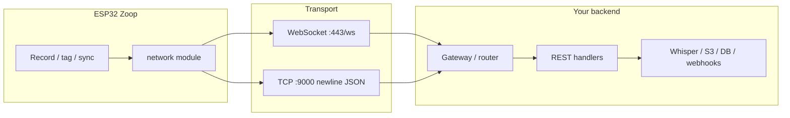

# Zoop

**Zoop Pay** — UPI collect on the Waveshare ESP32-S3 e-Paper board (QR on e-Ink, hold REC to show). Evolved from a Palma Notes–style voice notepad port.

- **Reference firmware (C/Arduino):** [`pala_note/`](./pala_note/) — historical voice-note reference  
- **Rust IoT port (in progress):** see [`TODO.md`](./TODO.md)  
- **QR scan → string (camera kit):** [`TODO_qr.md`](./TODO_qr.md) · [`docs/qr/`](./docs/qr/README.md)  
- **Per-file API docs:** [`docs/`](./docs/README.md)  
- **Architecture (UPI collect):** [`docs/architecture.md`](./docs/architecture.md)  
- **UI capabilities + UPI QR preview:** [`docs/core/ui-capabilities.md`](./docs/core/ui-capabilities.md)
- **Fresh laptop setup (macOS / Linux / Windows / Termux):** [`scripts/README.md`](./scripts/README.md)
- **OceanLabz DIY AI Voice Kit (hardware source of truth):** [`physical-components/hardware_spec.md`](./physical-components/hardware_spec.md)
- **Physical kit / breadboard beginner guide:** [`physical-components/README.md`](./physical-components/README.md)

---

## Features (v1.0 target)

- Voice recording directly onto the microSD card  
- Simple tag system for organizing recordings  
- Deep sleep for better battery life  
- Minimal E-Ink UI optimized for low power  
- Wi‑Fi syncing  
- AI transcription via OpenAI Whisper API  
- Local web interface for recordings and notes  
- Audio playback on the device  
- Transfer mode for downloading recordings in the browser  
- Customizable tags  
- Sound feedback for button presses  
- Battery level on the home screen  
- FAT32 microSD support  
- Designed for the Waveshare ESP32 E-Ink board  
- Optimized for a compact 3D-printed snap-fit enclosure  
- Open source, community-friendly firmware  

---

## Hardware

### Board

| Item | Spec |
| --- | --- |
| Board | Waveshare **ESP32-S3-ePaper-1.54** (`S3_ePaper_1_54`) |
| MCU | ESP32-S3 (dual-core up to 240 MHz), Wi‑Fi + BLE |
| Display | 1.54″ e-Paper, **200 × 200** |
| Audio | ES8311 codec, onboard mic + speaker header |
| Storage | microSD (SDIO 1-bit) |
| Sensors | PCF85063 RTC, SHTC3 temp/humidity |
| Power | Li‑ion charge IC, MX1.25 / GH1.25 battery connector |

Docs: [Waveshare ESP32-S3-ePaper-1.54](https://docs.waveshare.com/ESP32-S3-ePaper-1.54)

### Battery (recommended baseline)

- **3.7 V LiPo 602530, 500 mAh** (≈ 32 × 25 × 6 mm)  
- Link: https://geni.us/Bs2mF (AliExpress / Amazon)

**Notes**

- Some packs ship with a different JST connector; swap to match the board (see Assembly).  
- Use a small piece of foam or double-sided tape so the cell does not rattle in the case.

### SD card

- Any **FAT32**-formatted microSD for recordings and notes.  
- Prefer a known brand with decent random-write performance (see upgrades below).

### Filament

- **PETG** (recommended): https://geni.us/petgorigami  
- PETG is fine for everyday snap-fit use.

---

## What else to buy for better performance

These upgrades stay compatible with the same board and enclosure; pick what matches your budget.

| Upgrade | Why it helps | Suggestion |
| --- | --- | --- |
| Larger LiPo | Longer record / sync sessions between charges | 602530 **1000 mAh** or 603040 **800–1200 mAh** *if it still fits the case* |
| High-endurance / A2 microSD | Fewer stalls while writing WAV; better for always-on SD use | 32–64 GB **A2 / High Endurance** (SanDisk, Samsung, Kingston) |
| Correct MX1.25 / GH1.25 pigtail | Avoid flaky power from adapter hacks | Pre-crimped cable matching the Waveshare battery header |
| Foam / 3M VHB tape | Keeps battery and SD seating solid under pocket use | Thin foam + double-sided tape strip |
| External speaker (MX1.25) | Louder, clearer playback than the tiny onboard driver | 8 Ω 0.5–1 W mini speaker that fits the shell |
| Better PETG (or ASA) | Stronger snap-fit, less warp than cheap PLA | Dry PETG; ASA if you leave it in a hot car |
| USB‑C data cable (known good) | Reliable flashing and serial logs | Short, data-capable cable (not charge-only) |
| Silica packet / dry box for filament | Cleaner prints → better lid fit around the E-Ink | Optional but worth it for snap-fit tolerances |

**Diminishing returns / usually skip**

- Huge SD cards (128 GB+): waste for voice notes; format overhead and power draw rise.  
- Oversized batteries that force case mods: defeats the snap-fit design.  
- External Wi‑Fi antennas: board uses the onboard antenna; enclosure RF cutouts matter more than buying extras.

---

## Complete kit comparison

Pick one row as a shopping list. Prices are relative (**$** low → **$$$** higher); buy links change often — use the board vendor + the geni.us links above as starting points.

### Kit overview

| Kit | Best for | Relative cost | Est. battery life* | Record reliability | Playback | Print durability |
| --- | --- | --- | --- | --- | --- | --- |
| **Starter** | First build / validate firmware | $ | Short day of light use | OK | Onboard / basic | Good |
| **Recommended** | Daily carry (default buy) | $$ | Full day light use | Strong | Clear enough | Strong |
| **Performance** | Heavy recording + sync | $$$ | Multi-day light / long sessions | Best | Loud & clear | Best |
| **Dev / lab** | Flashing & debugging on the desk | $$ | N/A (often USB-powered) | Strong | Optional | Any |

\*Battery life is rough and depends on Wi‑Fi sync frequency, E-Ink refreshes, and sleep behavior.

### Bill of materials by kit

| Part | Starter | Recommended | Performance | Dev / lab |
| --- | --- | --- | --- | --- |
| Waveshare ESP32-S3-ePaper-1.54 | ✓ | ✓ | ✓ | ✓ |
| LiPo | 500 mAh 602530 | 500–800 mAh, correct connector | Largest that fits (≈800–1200 mAh) | Optional / USB only |
| microSD | 16 GB FAT32, any brand | 32 GB A1/A2 name brand | 32–64 GB **A2 / High Endurance** | 32 GB A2 |
| Filament | PETG | Dry PETG | Dry PETG or ASA | PLA OK for jigs |
| Battery tape / foam | Optional | ✓ | ✓ | — |
| Connector fix (if needed) | DIY swap | Pre-made MX1.25 lead | Pre-made MX1.25 lead | — |
| External speaker | — | Optional | ✓ fitted in case | Bench speaker |
| USB‑C data cable | Basic | Known-good | Known-good + spare | ✓ + UART if needed |
| Enclosure STL print | ✓ | ✓ | ✓ (tight tolerances) | Open jig / no case |

### When to choose which

| If you want… | Choose |
| --- | --- |
| Cheapest path to a working note-taker | **Starter** |
| Balanced pocket device matching pala_note design intent | **Recommended** |
| Longer sessions, fewer SD write glitches, louder playback | **Performance** |
| Firmware work without caring about battery fit yet | **Dev / lab** |

---

## Assembly tips

1. Confirm battery connector polarity and pitch (**MX1.25 / GH1.25** on the Waveshare board) before plugging in.  
2. Format the microSD as **FAT32** on a computer before first boot.  
3. Secure the cell with foam/double-sided tape so it cannot press the E-Ink or SD slot.  
4. Print the snap-fit shell in **PETG**; dry the filament if lids feel soft or warped.  
5. Flash over USB‑C; keep the board powered (USB or battery hold) during first bring-up.

---

## Backend integration — TCP & WebSocket

v1 firmware (like `pala_note`) talks to the outside world in two ways today:

| Path | Protocol | Role |
| --- | --- | --- |
| **Transfer portal** | HTTP on device (`:80`) | Browser downloads notes from the ESP32 on LAN |
| **Whisper sync** | HTTPS from device → OpenAI | Device uploads WAV; no custom backend |

A **custom backend** (your server) can sit in the middle: the device sends events over **TCP** or **WebSocket**, and the backend **triggers APIs** (transcription, storage, push notifications, webhooks). This keeps heavy work off the ESP32 and off the public internet from the device.

### Architecture overview



**Flow:** device emits a **command event** → backend **validates + routes** → backend calls **downstream APIs** → optional **reply** to device over the same socket.

---

### When to use WebSocket vs raw TCP

| | **WebSocket** | **Raw TCP** |
| --- | --- | --- |
| **Best for** | App-style sync, live status, browser dashboards | Simple device firmware, minimal deps |
| **Framing** | Built-in message boundaries | You define (newline JSON, length-prefix) |
| **Firewall / TLS** | Standard `wss://` on 443 | Custom port; may need VPN or LAN |
| **ESP32 support** | `esp-idf` WebSocket client (`esp_websocket_client`) | `esp-idf-svc` / BSD sockets |
| **Backend** | Axum, FastAPI, Node `ws`, Cloudflare Workers | Any TCP listener + line parser |
| **Battery** | Long-lived connection; use heartbeat + sleep policy | Connect → send → disconnect per sync (lower idle cost) |

**Recommendation for Zoop**

- **v1 parity:** keep HTTP transfer portal + direct Whisper (no backend required).
- **v2+ with backend:** prefer **WebSocket (`wss://`)** for `sync`, `transcribe`, and progress updates; use **short TCP sessions** only if you want the smallest firmware surface.

---

### Message format (shared contract)

Use **newline-delimited JSON** (NDJSON) for TCP; the same JSON objects work as WebSocket text frames.

**Device → backend (trigger API)**

```json
{"type":"transcribe","device_id":"zoop-a1b2","note":12,"ts":"2026-07-11T14:30:00Z"}
{"type":"sync_index","device_id":"zoop-a1b2","notes":[{"num":12,"tag":"Work","has_text":false}]}
{"type":"ping","device_id":"zoop-a1b2"}
```

**Backend → device (result / command)**

```json
{"type":"transcribe_ok","note":12,"text":"Meeting at three..."}
{"type":"transcribe_err","note":12,"code":"whisper_timeout"}
{"type":"pong"}
{"type":"wake_transfer","url":"http://192.168.1.42/"}
```

| `type` (device → backend) | Backend action |
| --- | --- |
| `transcribe` | `POST /v1/audio/transcriptions` (Whisper) or your STT service; store `.txt`; reply `transcribe_ok` |
| `sync_index` | Upsert rows in DB; dedupe by `device_id` + `note` |
| `upload_wav` | Backend opens secondary **HTTP PUT** or **chunked TCP** stream for binary; or device uses pre-signed S3 URL returned in `upload_url` message |
| `tag_changed` | Update DB; optional webhook to Notion/Slack |
| `ping` | Health check; reply `pong` |

---

### WebSocket — trigger backend APIs

**Connect (device, after WiFi up)**

```
wss://api.example.com/v1/devices/zoop-a1b2/ws
Authorization: Bearer <device_token>
```

**Example session**

1. Device connects during **Menu → Sync** (or always-on in dev).
2. Device sends one text frame per command (JSON above).
3. Backend handler parses `type`, calls internal services:

```text
on message "transcribe":
  → load WAV from device (HTTP GET device /wav?num=12 OR object store)
  → POST Whisper API
  → save transcript
  → send WebSocket frame { type: "transcribe_ok", ... }
```

4. Device writes `note_012.txt` on SD and sets `has_text=1` in `index.csv`.
5. Device disconnects when sync completes (save battery).

**Backend sketch (pseudo-code)**

```python
# FastAPI + websockets example
async def device_ws(ws: WebSocket, device_id: str):
    await ws.accept()
    async for raw in ws.iter_text():
        msg = json.loads(raw)
        match msg["type"]:
            case "transcribe":
                text = await whisper.transcribe(device_id, msg["note"])
                await ws.send_json({"type": "transcribe_ok", "note": msg["note"], "text": text})
            case "sync_index":
                await db.upsert_notes(device_id, msg["notes"])
                await ws.send_json({"type": "sync_ok"})
```

**Why WebSocket here:** one connection handles many commands, server can **push** `wake_transfer` or firmware hints without the device polling HTTP.

---

### Raw TCP — trigger backend APIs

Use a **dedicated port** (e.g. `9000`) with **one JSON object per line** (same schema as WebSocket).

**Connect (device)**

```text
TCP connect api.example.com:9000
→ send: {"type":"auth","device_id":"zoop-a1b2","token":"..."}\n
← recv: {"type":"auth_ok"}\n
→ send: {"type":"transcribe","note":12}\n
← recv: {"type":"transcribe_ok","note":12,"text":"..."}\n
→ close
```

**Backend sketch**

```rust
// Line-based TCP listener
loop {
    let line = read_line(&mut stream).await?;
    let msg: DeviceMsg = serde_json::from_str(&line)?;
    let reply = router.dispatch(msg).await?;  // calls Whisper, DB, etc.
    writeln!(stream, "{}", serde_json::to_string(&reply)?)?;
}
```

**Firmware fit:** open socket only in sync state → send batch of `transcribe` for notes where `has_text=0` → read replies → close. Matches pala_note’s “WiFi on only during sync” model.

---

### Mapping device events to REST / external APIs

Backend acts as an **API gateway** — the ESP32 never holds OpenAI keys in v2 if you prefer:

| Device event | Backend internal call | External API |
| --- | --- | --- |
| `transcribe` | `TranscribeService::run(note_id)` | OpenAI Whisper, Deepgram, local GPU |
| `sync_index` | `NotesRepository::merge()` | Postgres / SQLite / S3 index |
| `upload_wav` | `Storage::put_object()` | S3, R2, MinIO |
| `tag_changed` | `Webhooks::emit("note.tagged")` | Zapier, Slack, custom HTTPS |
| `device_hello` | `Devices::register()` | Your admin UI |

Optional **HTTP callback** pattern (backend → other services):

```http
POST https://hooks.example.com/note-transcribed
Content-Type: application/json

{"device_id":"zoop-a1b2","note":12,"text":"...","tag":"Work"}
```

Triggered only **after** the WebSocket/TCP handler finishes Whisper — keeps device protocol simple.

---

### Security checklist

| Item | Practice |
| --- | --- |
| Auth | Per-device token in TLS (WSS) or first TCP `auth` line |
| TLS | `wss://` / TLS wrapper on TCP; no plaintext tokens on public WiFi |
| Rate limits | Per `device_id` on transcribe to control API cost |
| Binary uploads | Prefer pre-signed URL in JSON reply, not giant WebSocket frames |
| LAN transfer mode | HTTP portal stays local-only; no TCP/WS required for browser download |

---

### Relation to v1 firmware

| Feature | v1 (`pala_note`) | With backend (TCP/WS) |
| --- | --- | --- |
| Transcription | Device → OpenAI HTTPS | Device → backend → Whisper |
| Note export | HTTP portal on device | Same, or backend pulls via `sync_index` + `upload_wav` |
| Real-time UI | E-Ink only | Backend can mirror state to web app via WS |

Implementation tracked in [`TODO.md`](./TODO.md) Phase 3+; transport choice should follow the locked stack (`esp-idf-svc`, no SPA on device).

---

## Repo layout

```
zoop/
  docs/              # Per-file API docs — start at docs/README.md
                     #   UI: docs/core/ui-capabilities.md
  core/              # Host-testable logic — `cargo test` on Mac
  firmware/          # ESP32-S3 binary — `cargo build` / `cargo espflash`
  README.md          ← you are here
  TODO.md            ← Rust IoT port checklist
  pala_note/         ← reference C/Arduino firmware
```

---

## Getting started (development)

### Host tests (no board required)

Pure logic — storage, WAV headers, battery curve, state machine, Whisper parse, transcription config, portal helpers, **full offline app loop**, and **portal route handlers**:

```bash
cd core
cargo test
```

**77 tests** cover Phases 1–4 logic on Mac (~seconds).

#### Without hardware — recommended workflow

| Step | Command | What it verifies |
| --- | --- | --- |
| Unit + integration | `cd core && cargo test` | Storage, WAV, buttons, sleep, UI framebuffer, portal routes, Whisper mock, record→tag→delete loop |
| Lint | `cd core && cargo clippy -- -D warnings` | Production-grade core crate |
| **UI visual gallery** | `cargo run -p zoop-core --bin zoop-ui-preview` | Renders all 16 e-Paper screens → opens `target/ui-preview/index.html` |
| Offline simulator | `cd core && cargo run --bin zoop-sim` | Scripted demo against `MockStorage` + mock display |
| Firmware compile | `cd firmware && . ~/export-esp.sh && cargo build` | ESP32-S3 binary links (BSP stubs log over UART) |

Milestones M0–M4 are **host-verified** where noted below; flash the board for HIL sign-off.

Host tests use **trait-based mocks** (`Display`, `Storage`, `Audio`, `Buttons`, `PowerRails`) in `core/src/mock.rs` — same APIs the firmware BSP will implement.

**Cannot run on Mac without board:** E-Ink refresh, SD_MMC mount, ES8311 record/playback, deep sleep wake, real WiFi/HTTPS, LAN portal on `:80`.

### ESP32 firmware (requires board + esp-rs toolchain)

**One-time setup (macOS):**

```bash
# Rust (if needed)
curl --proto '=https' --tlsv1.2 -sSf https://sh.rustup.rs | sh

# esp-rs toolchain for ESP32-S3 (Xtensa)
cargo install espup espflash cargo-espflash ldproxy
espup install
# Every new terminal session (sets LIBCLANG_PATH, Xtensa GCC, and ~/.cargo/bin):
. ~/export-esp.sh   # e.g. /Users/you/export-esp.sh — path shown by espup
```

**Build & flash:**

```bash
cd firmware
cp secrets.example.toml secrets.toml   # edit WiFi + transcription keys — never commit secrets.toml
cargo build
cargo espflash flash --monitor
```

#### `secrets.toml` (transcription)

Copy `secrets.example.toml` to `secrets.toml` (gitignored). For **development**, use your Cursor API key instead of OpenAI:

```toml
transcription_provider = "cursor"
cursor_api_key = "crsr_..."          # cursor.com/dashboard → API Keys
openai_key = ""                      # optional in dev

# Production:
# transcription_provider = "openai"
# openai_key = "sk-..."
```

| Provider | Default host | Endpoint | Auth |
| --- | --- | --- | --- |
| `cursor` (dev) | `api.cursor.com` | `POST /v1/audio/transcriptions` | `Authorization: Bearer crsr_...` |
| `openai` (prod) | `api.openai.com` | `POST /v1/audio/transcriptions` | `Authorization: Bearer sk-...` |

Multipart upload matches the pala_note Whisper flow: `model=whisper-1`, `file=note.wav`, parse JSON `"text"`.

**Note:** As of mid-2026, `api.cursor.com` does not expose `/v1/audio/transcriptions` (returns 404). The firmware and `core/src/transcribe.rs` are wired for when Cursor adds it, or you can set `transcription_base_host` to an OpenAI-compatible STT proxy for local dev.

**Security:** Never commit `secrets.toml`. If an API key was pasted in chat or shared elsewhere, rotate it in the [Cursor dashboard](https://cursor.com/dashboard) (API Keys) or OpenAI platform immediately.

**M0 pass criteria:** UART shows `=== Zoop v1.0 ===` at 115200 baud.

If `cargo espflash` says **no such command `espflash`**, install the Cargo subcommand (the `espflash` binary alone is not enough):

```bash
cargo install cargo-espflash
```

If linking fails with **`linker ldproxy not found`**:

```bash
cargo install ldproxy
```

Verify tools: `which espflash ldproxy` and `cargo espflash --version`.

If `cargo check` fails with `custom toolchain 'esp' ... is not installed`, run `espup install` and source `export-esp.sh` first.

### Daily workflow

1. Change logic in `core/` → `cargo test` (Mac)
2. Wire into `firmware/` → `cargo build` (Mac, ~30–120 s)
3. Flash → `cargo espflash flash --monitor`
4. Exercise one milestone on the Waveshare board

See [`TODO.md`](./TODO.md) for phase milestones, pin map, and HIL test plans.

### Desi Notes
- https://randomnerdtutorials.com/esp32-s3-devkitc-pinout-guide/
- https://github.com/s60sc/ESP32-CAM_MJPEG2SD/blob/master/extras/I2C.jpg
- https://documentation.espressif.com/esp32-s3_datasheet_en.pdf
- https://lastminuteengineers.com/esp32-s3-devkitc-pinout-reference/
- https://github.com/78/xiaozhi-esp32
- https://www.printables.com/model/61978-ayodhya-ram-temple-no-supports-required/files
- https://app.sketchup.com/app
- https://www.youtube.com/watch?v=_HsZzkSYao0

### Came Module
- https://github.com/s60sc/ESP32-CAM_MJPEG2SD
- https://www.printables.com/model/75024-esp32-cam-case/files
- https://www.youtube.com/watch?v=GNP_wO85WBY

### mini setup and pins
- https://www.youtube.com/watch?v=wLX1W3z8CSA
- https://www.youtube.com/watch?v=aDaSp6zaqWM - face ui
---

## License / credits

Open source firmware direction inspired by the pala_note community build. Hardware by Waveshare. Rust port tracked in `TODO.md`.
