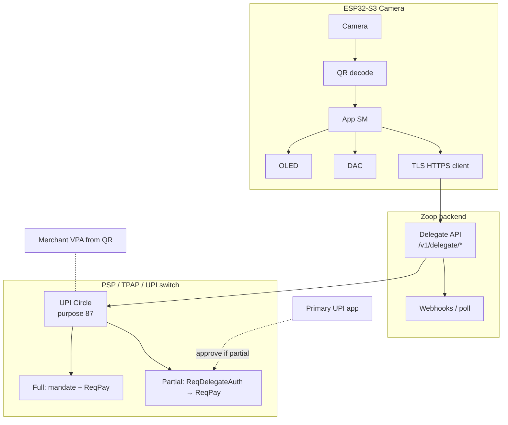

# Zoop Camera — QR scan → UPI Circle (delegate) pay

Companion product / hardware track for **Zoop Pay**: an **ESP32-S3 camera board** that **scans a UPI / Bharat QR**, confirms on **OLED**, then initiates payment via **UPI Circle delegate APIs** (NPCI purpose code **87**), with **microphone** and **DAC** for cues.

| | |
| --- | --- |
| Product | Zoop Scan — scan merchant QR → confirm → **delegate UPI pay** (UPI Circle) |
| Pay path (**locked v1**) | **UPI Circle / Delegate APIs** — not raw `upi://` handoff as primary |
| Related | Collect device: [`TODO.md`](./TODO.md) · [`docs/architecture.md`](./docs/architecture.md) |
| Target MCU | **ESP32-S3** (PSRAM strongly preferred for frames) |
| Display | **OLED** (SSD1306 / SH1106 I²C, or SPI — lock in Phase 0) |
| Audio in | **Microphone** (I²S MEMS preferred — lock in Phase 0) |
| Audio out | **DAC** / I²S DAC → speaker |
| Status legend | `[x]` host-verified · `[ ]` todo · `[ ] HIL` needs board |

> This file is the **source of truth** for the camera track. Do not mix camera BSP into the e-Paper `zoop-firmware` crate until Phase 0 decides **same workspace / second binary** vs **separate crate**.

---

## Product goals

- [ ] Scan UPI / Bharat QR (`upi://pay?...`) from live camera frames
- [ ] Parse payee VPA (`pa`), name (`pn`), amount (`am`), note (`tn`); reject non-UPI payloads
- [ ] Show decoded summary on **OLED** (amount, truncated VPA, delegate mode)
- [ ] **Pay via UPI Circle (delegate) APIs** — device (or Zoop backend as TPAP channel) drives:
  - [ ] Secondary-user initiated pay under **Full** or **Partial** delegation
  - [ ] Purpose code **87** (Delegate Payment) on pay requests
  - [ ] Limit / mandate checks before commit
- [ ] Confirm / cancel on-device (REC = pay, PWR = cancel)
- [ ] Beeps via **DAC** (scan ok, pending primary auth, success, fail)
- [ ] Optional mic: voice note or amount override (stretch)
- [ ] Deep sleep between scans; wake on button
- [ ] Host-testable parse + **delegate API client stubs** (no camera / no NPCI switch required for unit tests)

### Non-goals (v1)

- Continuous video streaming to phone
- Entering UPI PIN on the ESP32 (PIN stays on primary/secondary PSP app flow)
- Becoming a full PSP / bank switch implementation in firmware
- Replacing the e-Paper collect device
- **Primary** path = open raw `upi://` on a random phone (allowed only as **dev fallback**)

---

## UPI Circle / Delegate — locked model

NPCI **UPI Circle** lets a **primary** account holder authorize a **secondary** user to pay from the primary account under limits.

| Role | In Zoop Scan |
| --- | --- |
| **Primary** | Account owner (manager / parent / business owner) — linked in PSP app |
| **Secondary** | Clerk / device operator — Zoop Scan device acts as **channel** for secondary-initiated pays |
| **Full delegate** | Secondary pays within monthly / per-txn limits without per-txn primary PIN |
| **Partial delegate** | Each pay needs **primary authorization** (`ReqDelegateAuth` path) before `ReqPay` |
| **Purpose** | **87** — Delegate Payment on pay APIs |

### APIs the Zoop stack must speak (via backend / PSP partner)

Firmware should **not** talk to NPCI UPI switch directly. Device → **Zoop Delegate API** (HTTPS) → bank/PSP/TPAP integration that maps to NPCI messages.

| NPCI / PSP concept | Zoop backend surface (draft) | Notes |
| --- | --- | --- |
| Link secondary (Full) | `POST /v1/delegate/links` | Maps to delegate-add / mandate setup |
| Link secondary (Partial) | same + `auth_mode=partial` | Primary approves each txn later |
| Update / revoke link | `PATCH` / `DELETE /v1/delegate/links/{id}` | |
| Delegate auth (Partial) | `POST /v1/delegate/auth` | Poll or webhook until primary approves |
| Pay under delegation | `POST /v1/delegate/pay` | Body includes scanned `pa`/`am`/`tn`; purpose **87** |
| Query status | `GET /v1/delegate/pay/{id}` | Success / fail / pending auth |
| Limits | returned on link + enforced server-side | Align with NPCI caps (e.g. per-txn / monthly) |

Reference shapes (bank/PSP docs; names vary by integrator):

- Full: `ReqDelegateAdd` / auth under mandate → `ReqPay` (purpose 87)
- Partial: secondary initiates → `ReqDelegateAuth` to primary PSP → then `ReqPay` (purpose 87)

### Device → backend request (draft)

```json
{
  "device_id": "zoop-cam-a1b2",
  "delegate_link_id": "lnk_…",
  "mode": "full",
  "payee": {
    "vpa": "merchant@oksbi",
    "name": "Akash Soni",
    "amount_inr": "200.00",
    "note": "Zoop Scan",
    "raw_upi_uri": "upi://pay?pa=…"
  },
  "idempotency_key": "uuid"
}
```

```json
{
  "pay_id": "pay_…",
  "status": "pending_primary_auth | processing | success | failed",
  "purpose_code": 87,
  "umn": "…",
  "error": null
}
```

---

## Hardware kit

### Core

| Part | Role | Notes |
| --- | --- | --- |
| **ESP32-S3 camera board** | MCU + camera | OV2640/5640 + **PSRAM**; lock SKU in Phase 0 |
| **OLED** | Status UI | 128×64 I²C SSD1306 / SH1106 preferred |
| **Microphone** | Voice / future STT | I²S MEMS (INMP441-class) |
| **DAC** | Beeps / prompts | MAX98357A or board codec; mono OK |
| Buttons | Confirm / cancel / wake | ≥2 (REC / PWR semantics) |
| Battery | Portable | LiPo + ADC for OLED icon |
| **Wi‑Fi** | **Required** for delegate API | STA to Zoop backend (TLS) |

### Pin / resource conflicts (Phase 0)

| Resource | Camera | OLED | Mic | DAC | Risk |
| --- | --- | --- | --- | --- | --- |
| GPIO / DVP | Many | 2–4 | 3–4 I²S | 3–4 I²S | **High** |
| I²C | Often free | SDA/SCL | — | — | Medium |
| I²S | — | — | RX | TX | **High** — time-slice |
| PSRAM | Frames | — | audio | — | Required |
| Power | LED + sensor | — | — | amp | Brownout risk |

### BOM candidates (pick one in Phase 0)

| Kit | Camera | Notes |
| --- | --- | --- |
| A — Generic S3-CAM | OV2640 | + OLED + MAX98357 + INMP441 |
| B — XIAO ESP32S3 Sense | OV2640 | Mic often onboard; OLED external |
| C — Custom | OV5640 | Better scan distance |

---

## Locked tech stack (camera track)

| Layer | Use | Avoid (v1) |
| --- | --- | --- |
| Firmware | `esp-idf-svc` / `esp-idf-hal` | Embassy-only |
| Camera | ESP-IDF `esp_camera` | Raw DVP bitbang |
| QR decode | On-device `rqrr` / `quirc` | Cloud-only decode |
| OLED | Custom 128×64 or `ssd1306` + fonts | LVGL |
| **Payments** | **Zoop Delegate HTTPS client** → PSP/UPI Circle | Device → NPCI switch direct |
| UPI helpers | `zoop-core` parse + `delegate` module | Ad-hoc JSON in UI |
| Audio | I²S beeps first | On-device TTS |
| UI | Immediate-mode | Slint / egui on device |
| Layout | `core/` + `firmware-camera/` | One binary mixing e-Paper + camera without flags |
| Secrets | `secrets.toml` — Wi‑Fi, API base URL, device token | Keys in source |

---

## Architecture



### Collect vs Scan

| Collect (e-Paper) | Scan (Camera + Delegate) |
| --- | --- |
| Shows QR for customer to pay **in** | Scans QR and pays **out** under delegation |
| `build_upi_uri` | `parse_upi_uri` + `delegate::create_pay` |
| Any-amount / price-pick QR | Payee from QR; amount from QR or OLED override |
| Shared UPI string formats | Same `pa`/`am` fields into purpose-87 pay |

---

## Phases

### Phase 0 — Hardware + API partner lock

- [ ] Choose ESP32-S3 camera board (PSRAM, sensor)
- [ ] Choose OLED / mic / DAC; freeze pin map
- [ ] Crate layout: `firmware-camera/` (recommended)
- [ ] Link this file from [`README.md`](./README.md) / [`TODO.md`](./TODO.md)
- [ ] **Lock PSP/TPAP partner** or sandbox that exposes UPI Circle (Full + Partial)
- [ ] Document mapping: Zoop `/v1/delegate/*` ↔ vendor/NPCI message names
- [ ] Decide default mode on device: `full` vs `partial` (settings toggle)

**Exit:** BOM + pin map + sandbox credentials path in `secrets.example.toml`.

---

### Phase 1 — Host: parse + delegate client models

- [ ] `upi::parse_upi_uri` — `pa`, `pn`, `am`, `cu`, `tn`
- [ ] `ScanResult` — raw URI + parsed fields + decode confidence
- [ ] `delegate` module in `zoop-core`:
  - [ ] `DelegateMode::{ Full, Partial }`
  - [ ] `DelegateLink`, `DelegatePayRequest`, `DelegatePayStatus`
  - [ ] `purpose_code: 87` constant
  - [ ] Request/response JSON serde (no_std-friendly or `std` feature)
- [ ] Trait `DelegateApiClient` — mockable for tests
- [ ] Mock client: Full → `success`; Partial → `pending_primary_auth` → `success`
- [ ] Unit tests: URI goldens + status state machine
- [ ] Fixture QR images → parse only (no network)

**Exit:** `cargo test -p zoop-core delegate::` + `upi::` green.

---

### Phase 2 — OLED UI

| Screen | Content |
| --- | --- |
| Idle | ZOOP SCAN + battery + mode badge (`FULL`/`PART`) |
| Aiming | Point at QR |
| Decoded | Amount + VPA + REC=Pay PWR=Cancel |
| Sending | Calling delegate API… |
| WaitPrimary | Partial only — “Waiting approval” |
| Success / Fail | Result + beep |
| Settings | Mode, link status, Wi‑Fi |

- [ ] `oled_draw` / `oled_ui` immediate-mode
- [ ] Host preview optional
- [ ] HIL: Idle frame on real OLED

**Exit:** All states render in tests; HIL Idle.

---

### Phase 3 — Camera + QR decode

- [ ] `esp_camera` init (QQVGA/QVGA grayscale)
- [ ] PSRAM frame → decoder; **&lt; 500 ms** target
- [ ] Debounce N matching payloads
- [ ] Timeout / blur errors → OLED + DAC
- [ ] Stop stream after accept / cancel

**Exit:** HIL serial dump of parsed VPA + amount; OLED Decoded.

---

### Phase 4 — Delegate pay over HTTPS (**primary**)

- [ ] Wi‑Fi STA + TLS (cert bundle)
- [ ] Device auth: bearer device token from `secrets.toml`
- [ ] `POST /v1/delegate/pay` with scanned payee + `delegate_link_id` + mode
- [ ] Idempotency key per confirm press
- [ ] **Full:** poll until `success` / `failed` (timeout UX)
- [ ] **Partial:** OLED `WaitPrimary`; poll / webhook via long-poll until primary approves or denies
- [ ] Map API errors to OLED strings (limit exceeded, link inactive, network)
- [ ] Host integration test with `MockDelegateApiClient`
- [ ] HIL: sandbox Full pay end-to-end
- [ ] HIL: sandbox Partial pay with primary phone approve

#### Dev-only fallback (not product default)

- [ ] Feature-flag `intent_fallback_upi_uri`: SoftAP/BLE open raw `upi://` for bench testing without PSP

**Exit:** Full + Partial sandbox pays work; fallback behind flag.

---

### Phase 5 — Microphone + DAC

- [ ] DAC beeps: scan / sending / wait-primary / success / fail
- [ ] Mic level debug on OLED
- [ ] Stretch: attach voice note URL to `DelegatePayRequest`
- [ ] Stretch: STT amount override before pay
- [ ] Document I²S half-duplex sharing

**Exit:** Beeps on all major transitions.

---

### Phase 6 — Polish, sleep, docs

- [ ] Ultra-sleep; wake on button
- [ ] Battery on OLED
- [ ] Docs: `docs/camera/delegate-api.md` (sequences + purpose 87)
- [ ] Enclosure with camera + OLED window
- [ ] CI: host tests + `firmware-camera` build

---

## State machine (draft)

```text
Idle → Aiming
Aiming → Decoded
Decoded → Sending          (REC confirm)
Decoded → Idle             (PWR cancel)
Sending → WaitPrimary      (Partial + pending auth)
Sending → Success | Fail   (Full or auth done)
WaitPrimary → Success | Fail | Idle (timeout / cancel)
Success → Idle
Fail → Aiming | Idle
```

Rust: `state_camera.rs` + `delegate` status mapped into UI.

---

## Shared code with collect (`zoop-core`)

| Reuse | New |
| --- | --- |
| `format_amount_label`, URI encode helpers | `parse_upi_uri` |
| Button debounce, sleep timer, sounds | `delegate::*` client + types |
| Secrets pattern | Device token + API base URL |
| — | `PURPOSE_DELEGATE_PAY: u16 = 87` |

Keep OLED draw separate from e-Paper 200×200 framebuffer.

---

## Security & compliance

- [ ] TLS only to Zoop API; no cleartext pay payloads
- [ ] Confirm on OLED before `POST /v1/delegate/pay`
- [ ] No UPI PIN on device
- [ ] Enforce server-side limits; never trust device-only limit checks
- [ ] Audit log: device_id, pay_id, mode, amount, payee VPA (minimize PII in device logs)
- [ ] Revoke path: if link revoked mid-flight, fail closed
- [ ] Cool-off / NPCI limit rules handled by PSP — surface errors clearly on OLED

---

## Test plan

| Level | What |
| --- | --- |
| Unit | URI parse, delegate JSON, status transitions, purpose 87 constant |
| Mock API | Full success; Partial pending → success; limit exceeded |
| Host decode | Fixture QR images |
| HIL camera | Live decode → OLED Decoded |
| HIL Full | Sandbox delegate pay success |
| HIL Partial | Primary app approve / deny |
| Audio | Beeps without I²S glitches |

```bash
cargo test -p zoop-core upi::
cargo test -p zoop-core delegate::

. /path/to/export-esp.sh
cd firmware-camera && cargo build && cargo espflash flash
```

---

## Docs to add

| Doc | Content |
| --- | --- |
| `docs/camera/README.md` | Overview |
| `docs/camera/hardware.md` | BOM + pins |
| `docs/camera/delegate-api.md` | Full/Partial sequences, purpose 87, JSON |
| `docs/camera/qr-decode.md` | Resolution + decoder |

---

## Open decisions (Phase 0–1)

1. Camera board SKU + PSRAM  
2. OLED I²C vs SPI  
3. **Which PSP/sandbox** implements UPI Circle for Zoop  
4. Default mode: Full vs Partial  
5. Binary name: `zoop-camera` vs `zoop-scan`  
6. Mic in v1 or Phase 5 stretch  

---

## Milestone checklist

- [ ] Phase 0 — BOM + pins + **delegate API partner**  
- [ ] Phase 1 — Parse + `delegate` client (host)  
- [ ] Phase 2 — OLED UI  
- [ ] Phase 3 — Camera decode HIL  
- [ ] Phase 4 — **Delegate pay HIL** (Full + Partial)  
- [ ] Phase 5 — Mic + DAC  
- [ ] Phase 6 — Sleep, docs, enclosure  

**First vertical slice:** Phase 0 → 1 (mock delegate) → 3 (serial decode) → 2 (OLED confirm) → 4 Full sandbox pay → 4 Partial.
