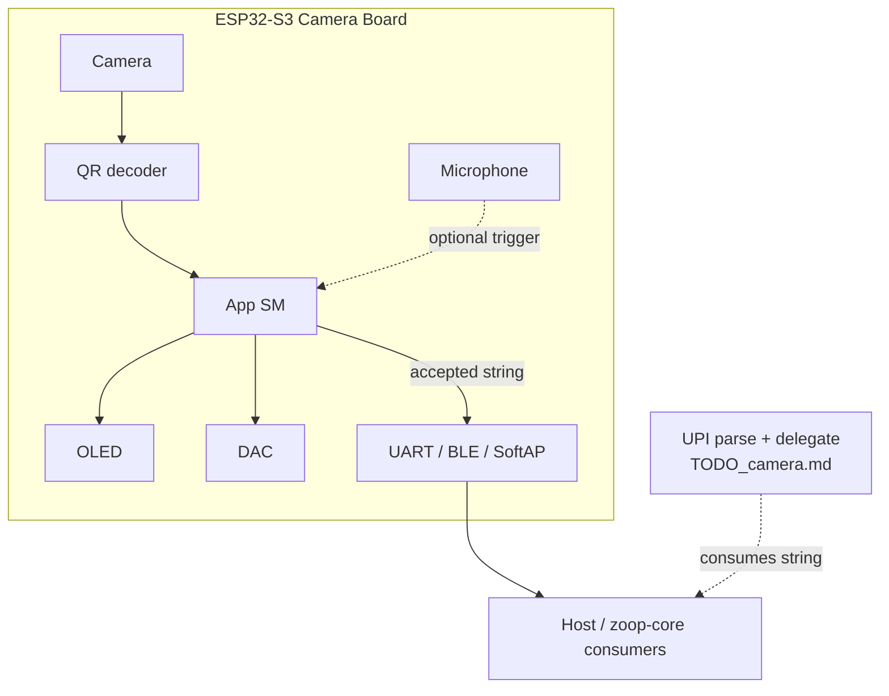

# Zoop QR — scan → string (camera kit)

Foundation track: **ESP32-S3 camera board** captures frames, **decodes a QR payload to a string**, shows result on **OLED**, with **microphone** / **DAC** cues. Payment / UPI Circle flows build on this — see [`TODO_camera.md`](./TODO_camera.md).

| | |
| --- | --- |
| Goal | Live QR scan → stable UTF-8 string (any payload; UPI is a consumer) |
| Related | Collect: [`TODO.md`](./TODO.md) · Scan/pay: [`TODO_camera.md`](./TODO_camera.md) · [`docs/architecture.md`](./docs/architecture.md) |
| Target MCU | **ESP32-S3** (PSRAM required for frames) |
| Display | **OLED** (SSD1306 / SH1106 I²C preferred — lock in Phase 0) |
| Audio in | **Microphone** (I²S MEMS preferred — lock in Phase 0) |
| Audio out | **DAC** / I²S amp → speaker |
| Status legend | `[x]` host-verified · `[ ]` todo · `[ ] HIL` needs board |

> Source of truth for **QR decode + string export**. Do not fold payment / delegate APIs into this track; keep `TODO_camera.md` for UPI Circle pay.

---

## Product goals

- [ ] Init camera on ESP32-S3 board; continuous preview / scan loop
- [ ] Decode QR from grayscale frames on-device → **raw string**
- [ ] Debounce: N consecutive identical payloads before accept
- [ ] Show truncated payload + status on **OLED**
- [ ] Confirm / cancel (REC = accept string, PWR = discard / rescan)
- [ ] Beeps via **DAC** (aiming tick optional, scan ok, fail / timeout)
- [ ] Optional mic: voice cue to start scan, or level meter on OLED (stretch)
- [ ] Export accepted string over UART / BLE / SoftAP for host tools
- [ ] Host-testable decode from fixture images (no camera required)

### Non-goals (v1)

- Parsing / validating UPI (belongs in `TODO_camera.md` / `zoop-core` `upi::`)
- Delegate pay / HTTPS payment APIs
- Continuous video stream to phone
- Multi-QR in one frame (pick largest / center first later)
- On-device OCR (QR only)

---

## Hardware kit

Same kit as the camera scan product — lock SKU + pins in Phase 0.

| Part | Role | Notes |
| --- | --- | --- |
| **ESP32-S3 camera board** | MCU + sensor | OV2640 / OV5640 + **PSRAM** |
| **OLED** | Aiming / result UI | 128×64 I²C SSD1306 / SH1106 |
| **Microphone** | Scan trigger / levels | I²S MEMS (INMP441-class) |
| **DAC** | Beeps | MAX98357A or board codec |
| Buttons | Accept / cancel / wake | ≥2 (REC / PWR) |
| Battery | Portable | LiPo + ADC for OLED icon |

### Pin / resource conflicts

| Resource | Camera | OLED | Mic | DAC | Risk |
| --- | --- | --- | --- | --- | --- |
| GPIO / DVP | Many | 2–4 | 3–4 I²S | 3–4 I²S | **High** |
| I²C | Often free | SDA/SCL | — | — | Medium |
| I²S | — | — | RX | TX | **High** — time-slice |
| PSRAM | Frames | — | buffers | — | Required |

### BOM candidates (pick one in Phase 0)

| Kit | Camera | Notes |
| --- | --- | --- |
| A — Generic S3-CAM | OV2640 | + OLED + MAX98357 + INMP441 |
| B — XIAO ESP32S3 Sense | OV2640 | Mic often onboard; OLED external |
| C — Custom | OV5640 | Better scan distance / focus |

---

## Locked tech stack (QR track)

| Layer | Use | Avoid (v1) |
| --- | --- | --- |
| Firmware | `esp-idf-svc` / `esp-idf-hal` | Embassy-only |
| Camera | ESP-IDF `esp_camera` | Raw DVP bitbang |
| QR decode | On-device `rqrr` and/or `quirc` | Cloud-only decode |
| OLED | Custom 128×64 or `ssd1306` + fonts | LVGL |
| Audio | I²S beeps first | On-device TTS |
| UI | Immediate-mode | Slint / egui on device |
| Layout | `core/` decode helpers + `firmware-qr/` (or shared `firmware-camera/`) | Mixing e-Paper BSP |
| Host tests | Fixture PNGs / greyscale buffers | Requiring HIL for unit CI |

---

## Architecture



### String contract

| Field | Notes |
| --- | --- |
| `payload: String` / `&str` | Exact bytes decoded as UTF-8 (lossy policy TBD Phase 1) |
| `format` | QR version / ECC if available |
| `confidence` | Optional: match count / frames agreed |
| `raw_upi_uri` | Only if consumer parses `upi://` — not required here |

Accepted output example (serial JSON line):

```json
{"ok":true,"payload":"upi://pay?pa=merchant@oksbi&am=200.00","len":42,"ms":180}
```

---

## Phases

### Phase 0 — Hardware lock

- [ ] Choose ESP32-S3 camera board (PSRAM, sensor)
- [ ] Choose OLED / mic / DAC; freeze pin map
- [ ] Decide crate: dedicated `firmware-qr/` vs share `firmware-camera/`
- [ ] Link this file from [`README.md`](./README.md) / [`TODO.md`](./TODO.md)
- [ ] Document shared pins with [`TODO_camera.md`](./TODO_camera.md)

**Exit:** BOM + pin map + flash/build path documented.

---

### Phase 1 — Host: decode string from fixtures

- [ ] `qr::decode_grayscale(width, height, pixels) -> Result<String, DecodeError>`
- [ ] Errors: `NotFound`, `TooBlurry`, `InvalidUtf8`, `TooLarge`
- [ ] Fixture corpus: plain text, URL, long string, UPI URI (assert **raw string** only)
- [ ] Debounce helper: `N` identical results → `Accepted`
- [ ] Unit tests green without camera

**Exit:** `cargo test -p zoop-core qr::` green.

---

### Phase 2 — OLED UI (scan → string)

| Screen | Content |
| --- | --- |
| Idle | ZOOP QR + battery |
| Aiming | Point at QR |
| Decoded | Truncated string + REC=OK PWR=Retry |
| Fail | Timeout / no QR + retry |
| Export | “Sent” if UART/BLE export enabled |

- [ ] Immediate-mode OLED draw
- [ ] Truncate long payloads with ellipsis; optional scroll
- [ ] HIL: Idle + Decoded on real OLED

**Exit:** All states render in tests; HIL Idle + Decoded.

---

### Phase 3 — Camera + live decode (HIL)

- [ ] `esp_camera` init (QQVGA/QVGA grayscale)
- [ ] PSRAM frame → decoder; **&lt; 500 ms** target typical indoor QR
- [ ] Debounce N matching payloads
- [ ] Timeout / blur → OLED + DAC fail beep
- [ ] Stop stream after accept / cancel
- [ ] Serial dump of accepted string

**Exit:** HIL: point at printed QR → stable string on UART + OLED.

---

### Phase 4 — DAC + microphone

- [ ] DAC beeps: scan ok / fail / accept
- [ ] Mic level meter on OLED (debug)
- [ ] Stretch: clap / voice threshold starts Aiming
- [ ] Document I²S half-duplex sharing with DAC

**Exit:** Beeps on major transitions; mic debug path optional.

---

### Phase 5 — String export + polish

- [ ] UART line protocol (JSON or `QR:<payload>\n`)
- [ ] Optional BLE notify characteristic with payload
- [ ] Optional SoftAP: `GET /qr` last accepted string
- [ ] Deep sleep between scans; wake on button
- [ ] Docs: `docs/qr/hardware.md`, `docs/qr/decode.md`
- [ ] CI: host `qr::` tests + firmware build

**Exit:** Host tool can pull last scanned string without manual UART copy.

---

## State machine (draft)

```text
Idle → Aiming              (button or mic trigger)
Aiming → Decoded           (debounce accept)
Aiming → Fail              (timeout)
Decoded → Idle             (REC accept → export string)
Decoded → Aiming           (PWR retry)
Fail → Aiming | Idle
```

Rust: `state_qr.rs`; payment SM in `TODO_camera.md` takes `payload` after accept.

---

## Shared code

| Reuse from collect / camera | New here |
| --- | --- |
| Button debounce, sleep, sounds patterns | `qr::decode_*` |
| OLED fonts / draw primitives (if shared) | Debounce + export protocol |
| Secrets / Wi‑Fi (only if SoftAP export) | Fixture corpus |

UPI parse stays out of this crate surface until a consumer calls it.

---

## Test plan

| Level | What |
| --- | --- |
| Unit | Fixture images → exact expected strings |
| Debounce | Flicker between two codes never accepts |
| Host | UTF-8 edge cases / max length |
| HIL camera | Live printout → OLED + UART |
| Audio | Beeps without I²S glitches |

```bash
cargo test -p zoop-core qr::

. /path/to/export-esp.sh
cd firmware-qr && cargo build && cargo espflash flash
```

---

## Docs to add

| Doc | Content |
| --- | --- |
| `docs/qr/README.md` | Overview: scan → string |
| `docs/qr/hardware.md` | BOM + pin map |
| `docs/qr/decode.md` | Resolution, decoder choice, timing |
| `docs/qr/export.md` | UART / BLE / SoftAP contract |

---

## Open decisions (Phase 0–1)

1. Camera board SKU + PSRAM size  
2. OLED I²C vs SPI  
3. Decoder: `rqrr` vs `quirc` vs both (fallback)  
4. Crate name: `firmware-qr` vs share `firmware-camera`  
5. Invalid UTF-8: reject vs lossy replace  
6. Mic in v1 or Phase 4 stretch  

---

## Milestone checklist

- [ ] Phase 0 — BOM + pins  
- [ ] Phase 1 — Host decode fixtures → string  
- [ ] Phase 2 — OLED UI  
- [ ] Phase 3 — Camera HIL decode  
- [ ] Phase 4 — DAC (+ optional mic)  
- [ ] Phase 5 — Export, sleep, docs  

**First vertical slice:** Phase 0 → 1 (fixtures) → 3 (serial string) → 2 (OLED confirm) → 4 beeps → 5 export.

**Handoff to pay track:** accepted string → [`TODO_camera.md`](./TODO_camera.md) Phase 1 `parse_upi_uri` when payload is `upi://`.
