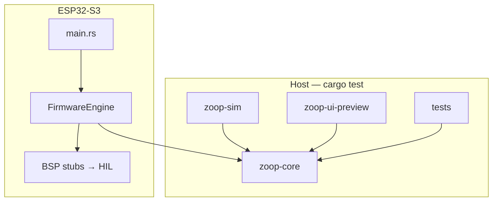

# Zoop documentation

Per-file reference for the Zoop workspace. Each page documents path, purpose, architecture placement (Mermaid), public API, dependencies, tests, status, and related docs.

**Start with the system map:** [architecture.md](architecture.md) — host vs device crates, UPI collect flow, and the payment state machine.

**Learn Embedded Rust:** [learning/README.md](learning/README.md) — beginner→advanced curriculum (peripherals, sensors, protocols, boards, projects).

**Learn Embedded Swift:** [swift/README.md](swift/README.md) — parallel Swift / Embedded Swift curriculum (same topics, SwiftPM + concurrency).

**See / review the E-Ink UI:** [core/ui-capabilities.md](core/ui-capabilities.md) — **UPI payment screens**, QR on e-Ink, and `zoop-ui-preview`.

```bash
cargo run -p zoop-core --bin zoop-ui-preview   # opens target/ui-preview/index.html (includes UPI QR)
```

## Architecture at a glance



Full diagrams: [architecture.md](architecture.md).

## How to navigate

1. Start here for the table of contents.
2. **New to Embedded Rust?** Start at [learning/](learning/README.md). Prefer Swift? Start at [swift/](swift/README.md).
3. Open a crate overview: [core/](core/README.md) or [firmware/](firmware/README.md).
4. **UI:** [core/ui-capabilities.md](core/ui-capabilities.md) → [core/display/](core/display/README.md).
5. Open a module README (e.g. [core/display/](core/display/README.md)), then a file page (e.g. [core/display/ui.md](core/display/ui.md)).
6. Build/CI config lives under [config/](config/README.md).

**Statuses:** *Host-verified* = covered by `cargo test` on CI. *HIL stub* = firmware compiles; hardware path pending. *Build-time* = compile/config only.

```bash
# Host logic
cargo test --workspace --exclude zoop-firmware

# Visual UI gallery (no board)
cargo run -p zoop-core --bin zoop-ui-preview

# Firmware (needs esp toolchain)
cd firmware && cargo build
```

**Out of scope:** `pala_note/` C++ reference is not documented file-by-file; Zoop ports its behavior into `core/` + `firmware/`.

---

## Core (`zoop-core`)

Overview: [core/README.md](core/README.md) · **UI capabilities:** [core/ui-capabilities.md](core/ui-capabilities.md)

### Root modules

| Doc | Source |
|-----|--------|
| [lib.md](core/lib.md) | `core/src/lib.rs` |
| [app.md](core/app.md) | `core/src/app.rs` |
| [payment.md](core/payment.md) | `core/src/payment.rs` |
| [upi.md](core/upi.md) | `core/src/upi.rs` |
| [battery.md](core/battery.md) | `core/src/battery.rs` |
| [buttons.md](core/buttons.md) | `core/src/buttons.rs` |
| [error.md](core/error.md) | `core/src/error.rs` |
| [io.md](core/io.md) | `core/src/io.rs` |
| [mock.md](core/mock.md) | `core/src/mock.rs` |
| [paths.md](core/paths.md) | `core/src/paths.rs` |
| [portal_fmt.md](core/portal_fmt.md) | `core/src/portal_fmt.rs` |
| [power.md](core/power.md) | `core/src/power.rs` |
| [record.md](core/record.md) | `core/src/record.rs` |
| [sleep.md](core/sleep.md) | `core/src/sleep.rs` |
| [sounds.md](core/sounds.md) | `core/src/sounds.rs` |
| [state.md](core/state.md) | `core/src/state.rs` |
| [time.md](core/time.md) | `core/src/time.rs` |
| [transcribe.md](core/transcribe.md) | `core/src/transcribe.rs` |
| [wav.md](core/wav.md) | `core/src/wav.rs` |
| [whisper_parse.md](core/whisper_parse.md) | `core/src/whisper_parse.rs` |

### Display

Overview: [core/display/README.md](core/display/README.md)

| Doc | Source |
|-----|--------|
| [mod.md](core/display/mod.md) | `core/src/display/mod.rs` |
| [draw.md](core/display/draw.md) | `core/src/display/draw.rs` |
| [ui.md](core/display/ui.md) | `core/src/display/ui.rs` |
| [qr.md](core/display/qr.md) | `core/src/display/qr.rs` |

### Network

Overview: [core/network/README.md](core/network/README.md)

| Doc | Source |
|-----|--------|
| [mod.md](core/network/mod.md) | `core/src/network/mod.rs` |
| [wifi.md](core/network/wifi.md) | `core/src/network/wifi.rs` |
| [portal.md](core/network/portal.md) | `core/src/network/portal.rs` |
| [whisper.md](core/network/whisper.md) | `core/src/network/whisper.rs` |

### Storage

Overview: [core/storage/README.md](core/storage/README.md)

| Doc | Source |
|-----|--------|
| [mod.md](core/storage/mod.md) | `core/src/storage/mod.rs` |
| [index.md](core/storage/index.md) | `core/src/storage/index.rs` |
| [tags.md](core/storage/tags.md) | `core/src/storage/tags.rs` |
| [meta.md](core/storage/meta.md) | `core/src/storage/meta.rs` |
| [mock.md](core/storage/mock.md) | `core/src/storage/mock.rs` |

### Binary & tests

| Doc | Source |
|-----|--------|
| [ui-capabilities.md](core/ui-capabilities.md) | Screen catalog + preview guide |
| [zoop_ui_preview.md](core/bin/zoop_ui_preview.md) | `core/src/bin/zoop_ui_preview.rs` |
| [zoop_sim.md](core/bin/zoop_sim.md) | `core/src/bin/zoop_sim.rs` |
| [tests/README.md](core/tests/README.md) | `core/tests/` |
| [integration_offline.md](core/tests/integration_offline.md) | `core/tests/integration_offline.rs` |
| [zoop_sim_flow.md](core/tests/zoop_sim_flow.md) | `core/tests/zoop_sim_flow.rs` |

---

## Firmware (`zoop-firmware`)

Overview: [firmware/README.md](firmware/README.md)

| Doc | Source |
|-----|--------|
| [main.md](firmware/main.md) | `firmware/src/main.rs` |

### App

Overview: [firmware/app/README.md](firmware/app/README.md)

| Doc | Source |
|-----|--------|
| [mod.md](firmware/app/mod.md) | `firmware/src/app/mod.rs` |
| [engine.md](firmware/app/engine.md) | `firmware/src/app/engine.rs` |

### Board

Overview: [firmware/board/README.md](firmware/board/README.md)

| Doc | Source |
|-----|--------|
| [mod.md](firmware/board/mod.md) | `firmware/src/board/mod.rs` |
| [config.md](firmware/board/config.md) | `firmware/src/board/config.rs` |
| [power.md](firmware/board/power.md) | `firmware/src/board/power.rs` |
| [rtc.md](firmware/board/rtc.md) | `firmware/src/board/rtc.rs` |
| [secrets.md](firmware/board/secrets.md) | `firmware/src/board/secrets.rs` |

### Audio

Overview: [firmware/audio/README.md](firmware/audio/README.md)

| Doc | Source |
|-----|--------|
| [mod.md](firmware/audio/mod.md) | `firmware/src/audio/mod.rs` |
| [es8311.md](firmware/audio/es8311.md) | `firmware/src/audio/es8311.rs` |

### Display

Overview: [firmware/display/README.md](firmware/display/README.md)

| Doc | Source |
|-----|--------|
| [mod.md](firmware/display/mod.md) | `firmware/src/display/mod.rs` |
| [epaper.md](firmware/display/epaper.md) | `firmware/src/display/epaper.rs` |
| [draw.md](firmware/display/draw.md) | `firmware/src/display/draw.rs` |
| [ui.md](firmware/display/ui.md) | `firmware/src/display/ui.rs` |

### Input

Overview: [firmware/input/README.md](firmware/input/README.md)

| Doc | Source |
|-----|--------|
| [mod.md](firmware/input/mod.md) | `firmware/src/input/mod.rs` |
| [buttons.md](firmware/input/buttons.md) | `firmware/src/input/buttons.rs` |

### Network

Overview: [firmware/network/README.md](firmware/network/README.md)

| Doc | Source |
|-----|--------|
| [mod.md](firmware/network/mod.md) | `firmware/src/network/mod.rs` |
| [wifi.md](firmware/network/wifi.md) | `firmware/src/network/wifi.rs` |
| [ntp.md](firmware/network/ntp.md) | `firmware/src/network/ntp.rs` |
| [portal.md](firmware/network/portal.md) | `firmware/src/network/portal.rs` |
| [whisper.md](firmware/network/whisper.md) | `firmware/src/network/whisper.rs` |

### Power

Overview: [firmware/power/README.md](firmware/power/README.md)

| Doc | Source |
|-----|--------|
| [mod.md](firmware/power/mod.md) | `firmware/src/power/mod.rs` |
| [sleep.md](firmware/power/sleep.md) | `firmware/src/power/sleep.rs` |

### Storage

Overview: [firmware/storage/README.md](firmware/storage/README.md)

| Doc | Source |
|-----|--------|
| [mod.md](firmware/storage/mod.md) | `firmware/src/storage/mod.rs` |
| [sd.md](firmware/storage/sd.md) | `firmware/src/storage/sd.rs` |

---

## Config & CI

Overview: [config/README.md](config/README.md)

| Doc | Source |
|-----|--------|
| [Cargo.workspace.md](config/Cargo.workspace.md) | `Cargo.toml` |
| [Cargo.core.md](config/Cargo.core.md) | `core/Cargo.toml` |
| [Cargo.firmware.md](config/Cargo.firmware.md) | `firmware/Cargo.toml` |
| [build.md](config/build.md) | `firmware/build.rs` |
| [secrets.example.md](config/secrets.example.md) | `firmware/secrets.example.toml` |
| [sdkconfig.defaults.md](config/sdkconfig.defaults.md) | `firmware/sdkconfig.defaults` |
| [rust-toolchain.md](config/rust-toolchain.md) | `firmware/rust-toolchain.toml` |
| [cargo-config.md](config/cargo-config.md) | `firmware/.cargo/config.toml` |
| [ci.md](config/ci.md) | `.github/workflows/ci.yml` |

---

## Doc count

See the repository `docs/` tree. Every `.rs` file under `core/` and `firmware/src/` has a matching `.md` page, plus module READMEs and config docs. Architecture: [architecture.md](architecture.md).
