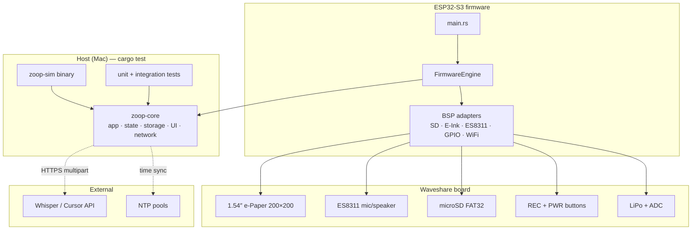
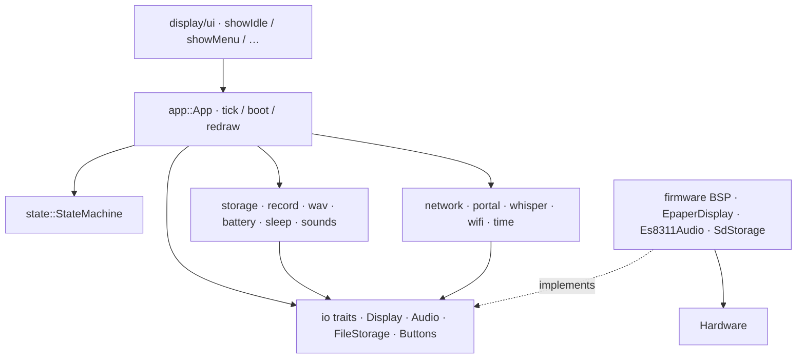
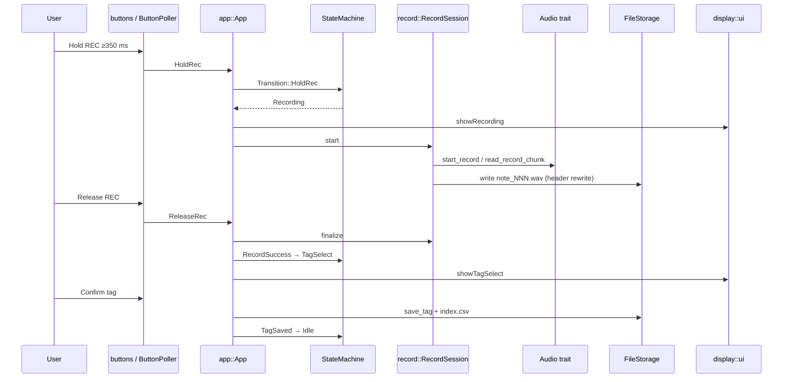
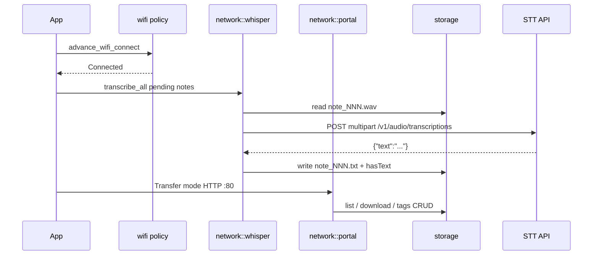
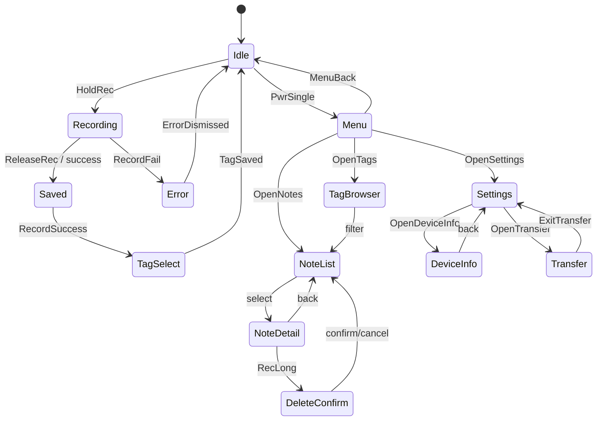
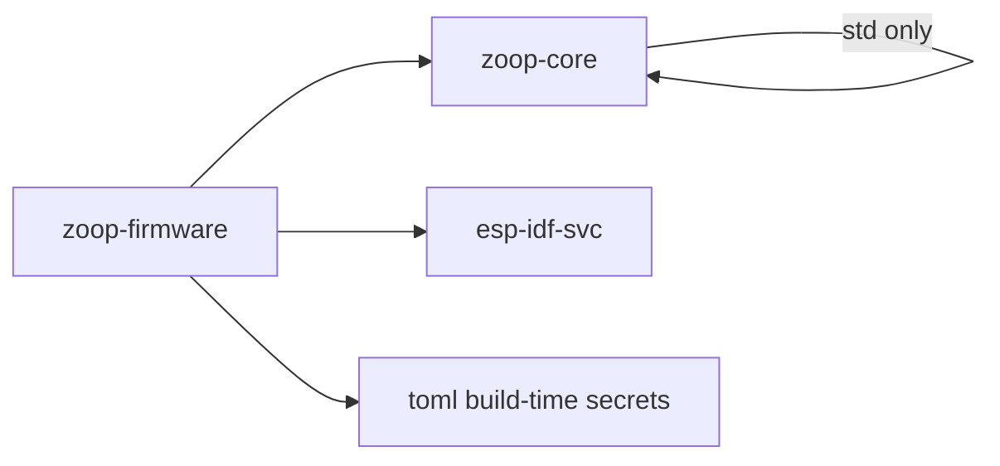

# Zoop architecture

System-level diagrams for the Zoop voice notepad. Individual file docs highlight their component with `style ModuleName fill:#f96,stroke:#333,stroke-width:3px` in Mermaid.

File index: [README.md](README.md).

## System overview

## Layered architecture

## Data flow — offline record

## Data flow — sync / portal

## State machine

## Crate dependency graph

## Where to go next

| Topic | Doc |
|-------|-----|
| Host logic overview | [core/README.md](core/README.md) |
| **E-Ink UI capabilities + preview** | [core/ui-capabilities.md](core/ui-capabilities.md) |
| Firmware BSP overview | [firmware/README.md](firmware/README.md) |
| Build / CI | [config/README.md](config/README.md) |
| File index | [README.md](README.md) |

Each file page includes a **Component in architecture** Mermaid diagram with that module highlighted.
