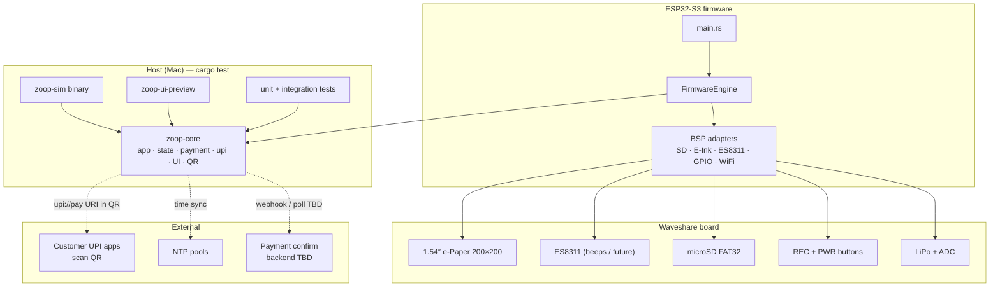
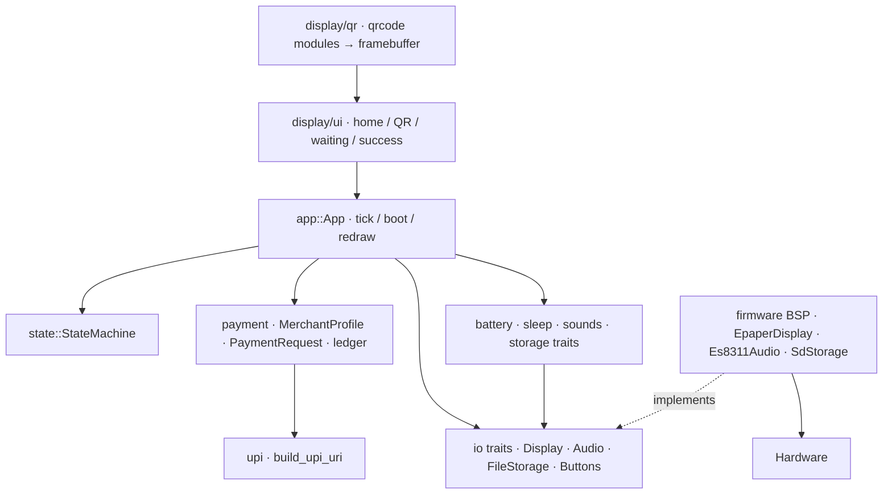
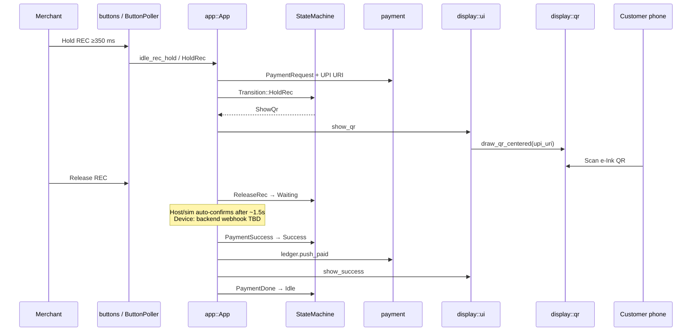
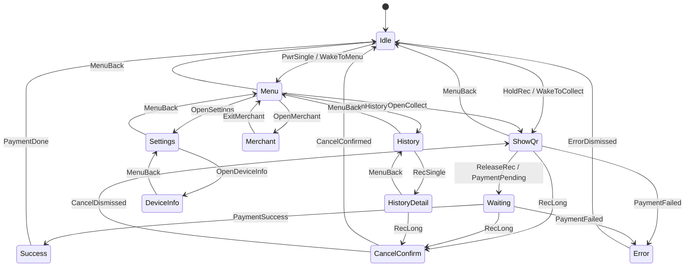
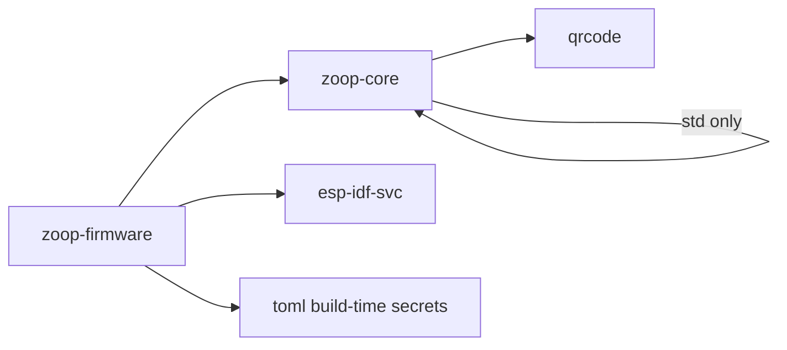

# Zoop architecture

System-level diagrams for **Zoop Pay** — UPI collect on Waveshare ESP32-S3 e-Paper. Individual file docs highlight their component with `style ModuleName fill:#f96,stroke:#333,stroke-width:3px` in Mermaid.

File index: [README.md](README.md).

## System overview

## Layered architecture

## Data flow — UPI collect

## State machine

## Crate dependency graph

## Legacy modules

Voice-note helpers (`record`, `wav`, `network::whisper`, `storage` index/tags, portal) remain in-tree for reuse / future sync, but the **primary UX path is UPI collect** via `payment` + `state` + `display/ui`.

## Where to go next

| Topic | Doc |
|-------|-----|
| Host logic overview | [core/README.md](core/README.md) |
| Payment models | [core/payment.md](core/payment.md) |
| State machine | [core/state.md](core/state.md) |
| **E-Ink UI + QR** | [core/ui-capabilities.md](core/ui-capabilities.md) |
| Firmware BSP overview | [firmware/README.md](firmware/README.md) |
| Build / CI | [config/README.md](config/README.md) |
| File index | [README.md](README.md) |

Each file page includes a **Component in architecture** Mermaid diagram with that module highlighted.
