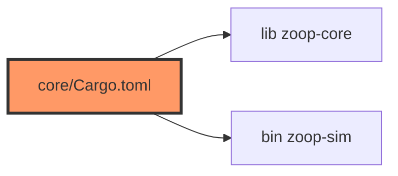

# core/Cargo.toml

- **Path:** `core/Cargo.toml`
- **Purpose:** Manifest for `zoop-core` — host-testable library plus `zoop-sim` binary. Std-friendly deps (`thiserror`, `tempfile`) suitable for Mac/Linux CI.

## Component in architecture

## Responsibilities

- **Does:** package metadata, lib + `[[bin]] name = zoop-sim`, dependencies
- **Does not:** embed ESP-IDF

## Key types / functions

N/A (manifest). Package `zoop-core`; bin path `src/bin/zoop_sim.rs`.

## Dependencies

- **Outbound:** `thiserror` 2, `tempfile` 3; workspace edition/license/version
- **Inbound:** firmware path dependency, CI, `zoop-sim`

## Tests

`cargo test -p zoop-core`

## Status

Build-time; crate is host-verified.

## Related

[../core/README.md](../core/README.md), [../architecture.md](../architecture.md)
