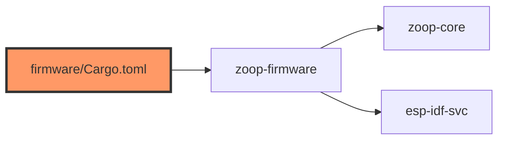

# firmware/Cargo.toml

- **Path:** `firmware/Cargo.toml`
- **Purpose:** Manifest for `zoop-firmware` — binary crate depending on `zoop-core` and `esp-idf-svc` 0.51, with embuild/toml build-deps and ESP-IDF v5.2.2 metadata.

## Component in architecture

## Responsibilities

- **Does:** firmware package + IDF feature flags / sdkconfig defaults path
- **Does not:** pin map (see `board/config.rs`)

## Key types / functions

N/A. `[[bin]] name = zoop-firmware` → `src/main.rs`. Build-deps: `embuild` 0.33, `toml` 0.8, `zoop-core`.

## Dependencies

- **Outbound:** `zoop-core` (path), `esp-idf-svc`, embuild
- **Inbound:** workspace member

## Tests

Not in default host CI; `cd firmware && cargo build`.

## Status

Build-time.

## Related

[../firmware/README.md](../firmware/README.md), [../architecture.md](../architecture.md)
