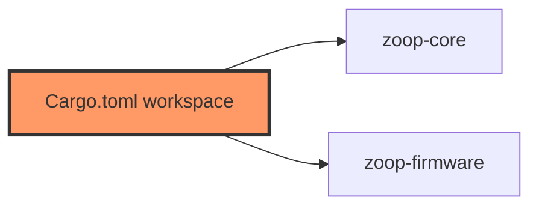

# Cargo.toml (workspace)

- **Path:** `Cargo.toml`
- **Purpose:** Workspace root defining members `core` and `firmware`, shared package edition (`2021`), version `0.1.0`, license, resolver `2`, and release profile (`opt-level = "s"`, LTO).

## Component in architecture



## Responsibilities

- **Does:** list members, workspace package defaults, size-oriented release profile
- **Does not:** embed app logic

## Key types / functions

N/A — TOML manifest. `members = ["core", "firmware"]`.

## Dependencies

Defines workspace; crates declare their own deps.

## Tests

```bash
cargo test --workspace --exclude zoop-firmware
```

## Status

Build-time.

## Related

[Cargo.core.md](Cargo.core.md), [Cargo.firmware.md](Cargo.firmware.md), [../architecture.md](../architecture.md)
