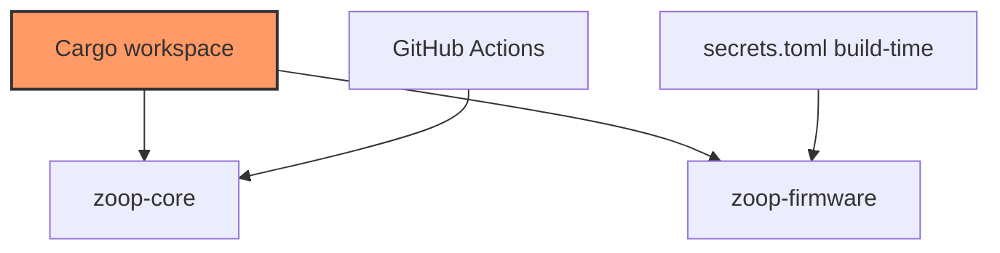

# Config & CI

Workspace manifests, firmware build/secrets/toolchain, and GitHub Actions.

## Component in architecture

[architecture.md](../architecture.md).

## Child docs

| Doc | Source |
|-----|--------|
| [Cargo.workspace.md](Cargo.workspace.md) | `Cargo.toml` |
| [Cargo.core.md](Cargo.core.md) | `core/Cargo.toml` |
| [Cargo.firmware.md](Cargo.firmware.md) | `firmware/Cargo.toml` |
| [build.md](build.md) | `firmware/build.rs` |
| [secrets.example.md](secrets.example.md) | `firmware/secrets.example.toml` |
| [sdkconfig.defaults.md](sdkconfig.defaults.md) | `firmware/sdkconfig.defaults` |
| [rust-toolchain.md](rust-toolchain.md) | `firmware/rust-toolchain.toml` |
| [cargo-config.md](cargo-config.md) | `firmware/.cargo/config.toml` |
| [ci.md](ci.md) | `.github/workflows/ci.yml` |

## Status

Build-time / CI — not runtime device code.
