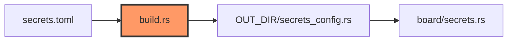

# firmware/build.rs

- **Path:** `firmware/build.rs`
- **Purpose:** Build script that runs embuild ESP-IDF sysenv output and generates `OUT_DIR/secrets_config.rs` from `secrets.toml` (fallback: `secrets.example.toml`). Emits WiFi + transcription constants consumed by `board/secrets.rs`.

## Component in architecture

## Responsibilities

- **Does:** `embuild::espidf::sysenv::output()`; parse TOML; `TranscriptionConfig::from_secrets`; write `WIFI_*`, `TRANSCRIPTION_*`, `LOCAL_TIME_OFFSET_MIN`
- **Does not:** runtime networking

## Key types / functions

Build-script `main` + `generate_secrets_config` (private).

## Dependencies

- **Outbound:** `embuild`, `toml`, `zoop_core::TranscriptionConfig`
- **Inbound:** cargo build of firmware

## Constants / formats

Generated consts: `WIFI_SSID`, `WIFI_PASS`, `LOCAL_TIME_OFFSET_MIN`, `TRANSCRIPTION_PROVIDER/HOST/PATH/API_KEY/MODEL/BOUNDARY`.

## Tests

Fails build on invalid provider/config.

## Status

Build-time.

## Related

[secrets.example.md](secrets.example.md), [../firmware/board/secrets.md](../firmware/board/secrets.md), [../architecture.md](../architecture.md)
