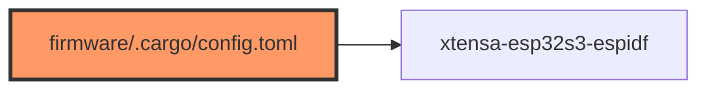

# .cargo/config.toml (firmware)

- **Path:** `firmware/.cargo/config.toml`
- **Purpose:** Target triple, linker, runner, `build-std`, and ESP-IDF env for `xtensa-esp32s3-espidf` firmware builds.

## Component in architecture

## Responsibilities

- **Does:** default target, `ldproxy` linker, `espflash` runner, unstable `build-std`, `MCU` / `ESP_IDF_VERSION` env
- **Does not:** application code

## Key types / functions

N/A. `target = xtensa-esp32s3-espidf`; `ESP_IDF_VERSION = v5.2.2`; `MCU = esp32s3`.

## Dependencies

- **Outbound:** espflash, ldproxy, esp-idf sysenv
- **Inbound:** cargo builds under `firmware/`

## Tests

N/A — used at build.

## Status

Build-time.

## Related

[rust-toolchain.md](rust-toolchain.md), [../architecture.md](../architecture.md)
