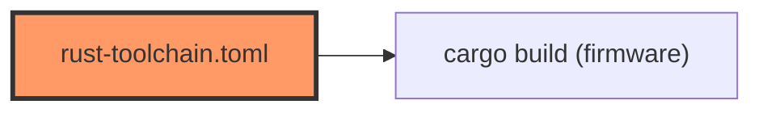

# rust-toolchain.toml

- **Path:** `firmware/rust-toolchain.toml`
- **Purpose:** Pins the Rust channel to `esp` so rustup selects the esp-rs toolchain (Xtensa) when building inside `firmware/`.

## Component in architecture

## Responsibilities

- **Does:** `channel = "esp"`
- **Does not:** set target triple (see `.cargo/config.toml`)

## Key types / functions

N/A — `[toolchain] channel = "esp"`.

## Dependencies

- **Outbound:** none
- **Inbound:** rustup / cargo when cwd is `firmware/`

## Tests

N/A.

## Status

Build-time.

## Related

[cargo-config.md](cargo-config.md), [../architecture.md](../architecture.md)
