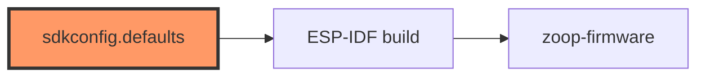

# sdkconfig.defaults

- **Path:** `firmware/sdkconfig.defaults`
- **Purpose:** ESP-IDF Kconfig defaults for Zoop on Waveshare ESP32-S3-ePaper-1.54 — target, CPU, PSRAM, logging, FreeRTOS tick, WiFi buffers, FAT LFN, sleep GPIO workaround.

## Component in architecture

## Responsibilities

- **Does:** baseline IDF options for this board
- **Does not:** application logic

## Key types / functions

N/A. Notable: `CONFIG_IDF_TARGET=esp32s3`, 240 MHz, main stack 8192, OPI PSRAM @ 80 MHz, log INFO, `FREERTOS_HZ=1000`, WiFi RX buffer counts, `FATFS_LFN_HEAP`, `ESP_SLEEP_GPIO_RESET_WORKAROUND`.

## Dependencies

- **Outbound:** none
- **Inbound:** `package.metadata.esp-idf-sys.esp_idf_sdkconfig_defaults` in firmware `Cargo.toml`

## Tests

Applied during firmware embuild.

## Status

Build-time.

## Related

[Cargo.firmware.md](Cargo.firmware.md), [../architecture.md](../architecture.md)
