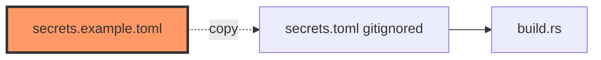

# secrets.example.toml

- **Path:** `firmware/secrets.example.toml`
- **Purpose:** Template for gitignored `secrets.toml` — WiFi credentials, transcription provider/keys, optional host override, and local time offset. Copy to `firmware/secrets.toml` locally; never commit real keys. `build.rs` falls back to the example if `secrets.toml` is missing.

## Component in architecture

## Responsibilities

- **Does:** document required TOML keys for STA + STT
- **Does not:** ship production secrets

## Key types / functions

N/A (TOML). Keys: `wifi_ssid`, `wifi_pass`, `transcription_provider` (`cursor`|`openai`), `cursor_api_key`, `openai_key`, optional `transcription_base_host`, `local_time_offset_min`.

## Dependencies

- **Outbound:** none
- **Inbound:** `firmware/build.rs` (fallback read)

## Constants / formats

Provider strings match `TranscriptionProvider::parse`. Offset is minutes east of UTC (example `120`).

## Tests

Build-time parse in `build.rs`.

## Status

Build-time template.

## Related

[build.md](build.md), [../firmware/board/secrets.md](../firmware/board/secrets.md), [../architecture.md](../architecture.md)
