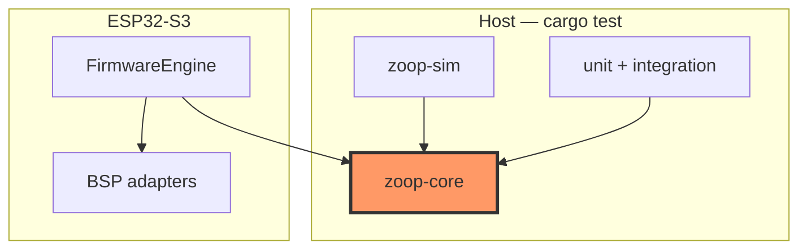

# Core crate (`zoop-core`)

Host-testable application logic for **Zoop Pay** (UPI collect on e-Paper) without ESP-IDF dependencies. Firmware implements the `io` traits and drives `App` from `FirmwareEngine`.

## Component in architecture



System-wide diagrams: [architecture.md](../architecture.md).

## Child docs

| Area | Docs |
|------|------|
| Crate root | [lib.md](lib.md), [app.md](app.md), [state.md](state.md), [payment.md](payment.md), [upi.md](upi.md), [error.md](error.md), [io.md](io.md), [mock.md](mock.md) |
| Input / power | [buttons.md](buttons.md), [battery.md](battery.md), [power.md](power.md), [sleep.md](sleep.md), [sounds.md](sounds.md) |
| Media (legacy / reuse) | [record.md](record.md), [wav.md](wav.md), [paths.md](paths.md) |
| Time / STT (legacy) | [time.md](time.md), [transcribe.md](transcribe.md), [whisper_parse.md](whisper_parse.md), [portal_fmt.md](portal_fmt.md) |
| Display | [display/](display/), **[ui-capabilities.md](ui-capabilities.md)** |
| Network | [network/](network/) |
| Storage | [storage/](storage/) |
| Bin / tests | [bin/zoop_ui_preview.md](bin/zoop_ui_preview.md), [bin/zoop_sim.md](bin/zoop_sim.md), [tests/](tests/) |

## How components interact

1. **`App::tick`** polls buttons, applies payment `Transition`s via `StateMachine`, advances Waiting→Success on host/sim, and redraws via `display::ui`.
2. **Collect** builds a `PaymentRequest` (`upi` URI) → QR on e-Ink → ledger on success.
3. **History / Merchant / Settings** are menu destinations; ultra-sleep skips ShowQr / Waiting / Error.
4. **Mocks** in `mock` / `storage::mock` implement `io` traits for host tests and `zoop-sim`.

## How to test

```bash
cargo test -p zoop-core
cargo test --workspace --exclude zoop-firmware
cargo run -p zoop-core --bin zoop-ui-preview
```

## Status

**Host-verified** — unit + integration tests on CI. Firmware consumes these APIs via BSP trait adapters (HIL stubs until board bring-up).

## Related

[payment.md](payment.md), [state.md](state.md), [../architecture.md](../architecture.md)
