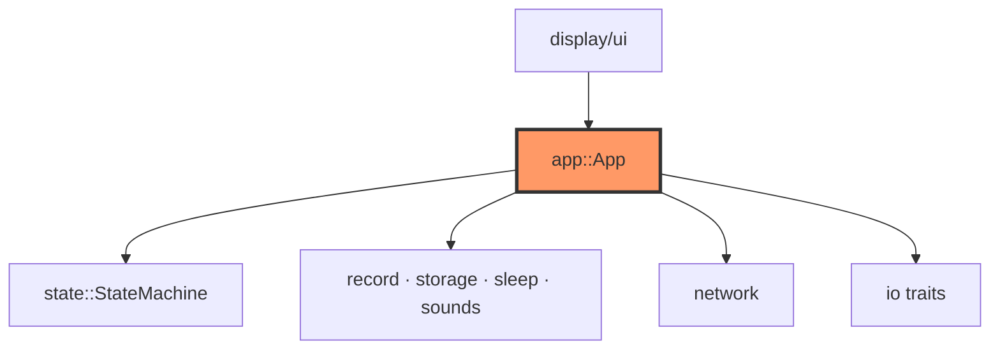
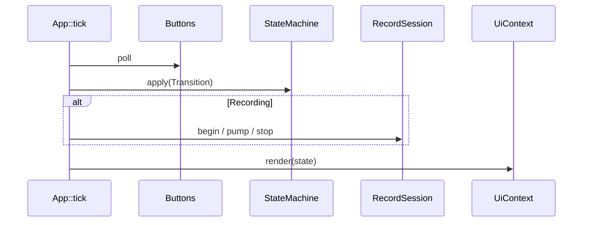

# app.rs

- **Path:** `core/src/app.rs`
- **Purpose:** High-level application engine that wires the state machine to BSP traits (storage, display, audio, time, battery) for offline UX flows. `App::boot` loads index/tags and draws Idle; `App::tick` is the main loop body used by both `zoop-sim` and firmware. It owns UI cursor indices, an optional `RecordSession`, and the last painted `ScreenId`.

## Component in architecture



## Responsibilities

- **Does:** boot, tick input→transition→side-effects, battery %, full redraw
- **Does not:** GPIO/SPI drivers, HTTP sockets, WAV sample math (delegates to other modules)

## Key types / functions

| Item | Role |
|------|------|
| `FIRMWARE_VERSION` | `"v1.0"` shown on device info / idle |
| `LOCAL_TIME_OFFSET_MIN` | `120` — device label offset from UTC |
| `App<'a, S, D, A, T, ADC>` | Generic over `FileStorage`, `Display`, `Audio`, `TimeSource`, `BatteryAdc` |
| `App::new(...)` | Construct with stores + mutable BSP refs |
| `App::boot(clock)` | Load index/tags, reset activity, redraw Idle |
| `App::tick(buttons, clock)` | Poll buttons, apply transitions, record/playback/UI |
| `App::battery_percent()` | ADC samples → percent via `battery` |
| `App::redraw(clock)` | Paint current `AppState` through `UiContext` |

## Data / control flow



## Dependencies

- **Outbound:** `battery`, `buttons`, `display::ui`, `error`, `io`, `paths`, `record`, `sleep`, `sounds`, `state`, `storage`
- **Inbound:** `firmware::app::engine`, `zoop-sim`, integration tests

## Constants / formats

- Version string `v1.0`; local offset `+120` minutes

## Tests

```bash
cargo test -p zoop-core app::tests
```

Covers `boot_loads_stores_and_renders_idle`.

## Status

Host-verified.

## Related

[state.md](state.md), [record.md](record.md), [display/ui.md](display/ui.md), [../firmware/app/engine.md](../firmware/app/engine.md), [../architecture.md](../architecture.md)
