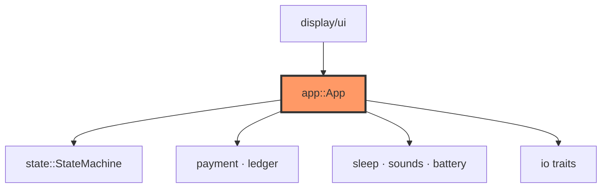

# app.rs

- **Path:** `core/src/app.rs`
- **Purpose:** High-level Zoop Pay engine wiring the payment state machine to BSP traits (storage, display, audio, time, battery). `App::boot` resets activity and draws Idle; `App::tick` is the main loop body for `zoop-sim` and firmware. Owns merchant profile, in-memory payment ledger, active collect request, and last painted `ScreenId`.

## Component in architecture



## Responsibilities

- **Does:** boot, tick input→transition→payment side-effects, battery %, full redraw
- **Does not:** GPIO/SPI drivers, bank confirmation network (host/sim auto-confirms Waiting after ~1.5s)

## Key types / functions

| Item | Role |
|------|------|
| `FIRMWARE_VERSION` | `"v1.0"` on device info |
| `App<'a, S, D, A, T, ADC>` | Generic over `FileStorage`, `Display`, `Audio`, `TimeSource`, `BatteryAdc` |
| `App::new(...)` | Construct with mutable BSP refs (ledger owned inside) |
| `App::boot(clock)` | Reset activity, redraw Idle |
| `App::tick(buttons, clock)` | Poll buttons, advance Waiting→Success, redraw |
| `App::battery_percent()` | ADC samples → percent |
| `App::redraw(clock)` | Paint current `AppState` through `UiContext` |

## Collect flow (buttons)

1. Idle + REC hold ≥350 ms → `ShowQr` + `PaymentRequest` (UPI URI in QR)
2. Release REC → `Waiting` (pending)
3. After ~1.5s (sim) or `PaymentSuccess` → `Success` + ledger push
4. After ~2.5s or REC single → `Idle`

Menu: Collect / History / Merchant / Settings.

## Dependencies

- **Outbound:** `battery`, `buttons`, `display::ui`, `error`, `io`, `payment`, `sleep`, `sounds`, `state`, `storage` (trait only), `upi`
- **Inbound:** `firmware::app::engine`, `zoop-sim`, integration tests

## Tests

```bash
cargo test -p zoop-core app::tests
cargo test -p zoop-core --test integration_offline
```

## Status

Host-verified.

## Related

[state.md](state.md), [payment.md](payment.md), [display/ui.md](display/ui.md), [../architecture.md](../architecture.md)
