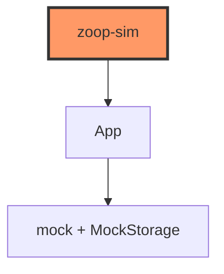
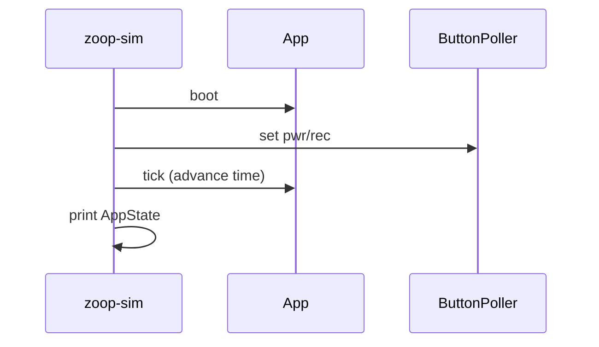

# bin/zoop_sim.rs

- **Path:** `core/src/bin/zoop_sim.rs`
- **Purpose:** Offline host harness that boots `App` against mocks and scripts a short UX demo (menu navigation, etc.) without ESP32 hardware. Useful for manual smoke-testing core changes.

## Component in architecture



## Responsibilities

- **Does:** construct mocks, `boot`, advance clock, inject button presses, print state
- **Does not:** flash firmware or open WiFi

## Key types / functions

Binary `main` only — helpers `advance(clock, buttons, app, ms)` locally.

## Data / control flow



## Dependencies

Outbound: `zoop_core::{app, buttons, mock, state, storage}`.

## Tests

Related flow covered by `core/tests/zoop_sim_flow.rs`. Run binary:

```bash
cargo run -p zoop-core --bin zoop-sim
```

## Status

Host-verified (manual + integration).

## Related

[../tests/zoop_sim_flow.md](../tests/zoop_sim_flow.md), [../app.md](../app.md), [../../architecture.md](../../architecture.md)
