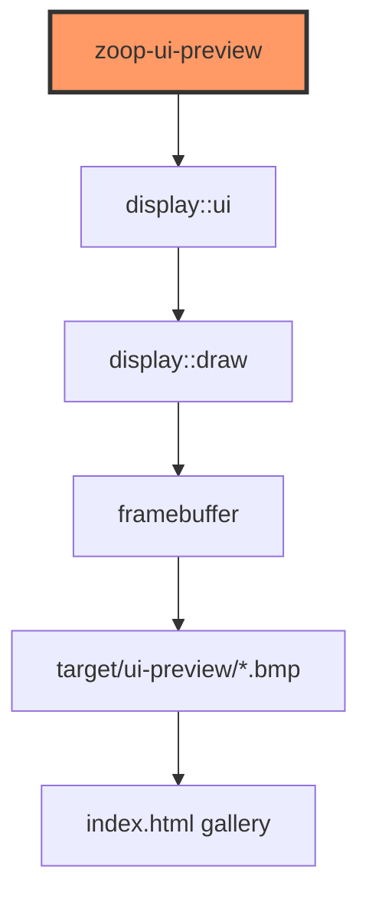
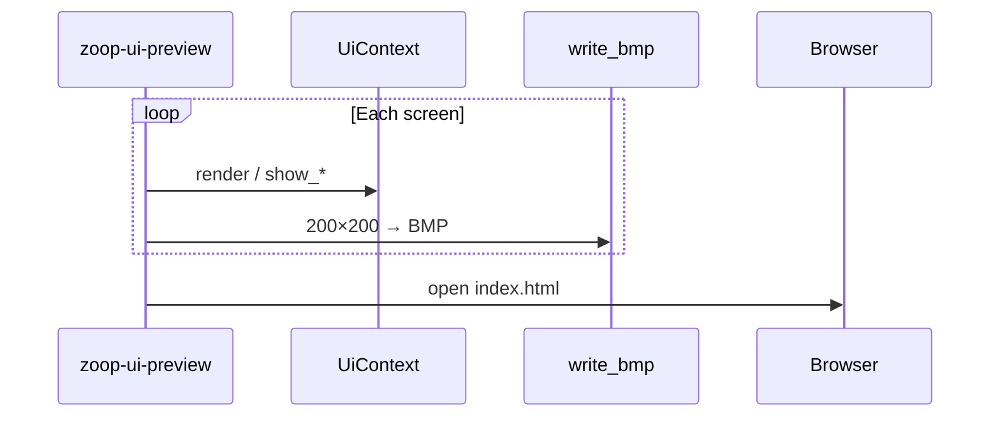

# bin/zoop_ui_preview.rs

- **Path:** `core/src/bin/zoop_ui_preview.rs`
- **Purpose:** Host visual QA tool. Renders every E-Ink screen into a 200×200 framebuffer, writes **BMP** files plus an **HTML gallery**, and opens the gallery in the default browser. Use this to judge layout and typography **without the Waveshare board**.

## Component in architecture



## How to run

```bash
cargo run -p zoop-core --bin zoop-ui-preview
```

Re-open without rebuilding:

```bash
open target/ui-preview/index.html
```

## Responsibilities

- **Does:** build sample `UiContext` data, call `render` / overlay helpers for all 16 `ScreenId`s, write BMPs, generate HTML, `open` on macOS
- **Does not:** simulate buttons (use [zoop_sim.md](zoop_sim.md)), talk to hardware

## Screens exported

| File | ScreenId |
|------|----------|
| `01_idle.bmp` | Idle |
| `02_recording.bmp` | Recording |
| `03_saved.bmp` | Saved |
| `04_tag_select.bmp` | TagSelect |
| `05_menu.bmp` | Menu |
| `06_settings.bmp` | Settings |
| `07_device_info.bmp` | DeviceInfo |
| `08_note_list.bmp` | NoteList |
| `09_note_detail.bmp` | NoteDetail |
| `10_delete_confirm.bmp` | DeleteConfirm |
| `11_transfer.bmp` | Transfer |
| `12_error.bmp` | Error |
| `13_battery_low.bmp` | BatteryLow |
| `14_ultra_sleep.bmp` | UltraSleep |
| `15_wifi_connecting.bmp` | WifiConnecting |
| `16_transcribing.bmp` | Transcribing |

Sample context: battery 78%, 3 notes, menu index Tags, tag Work, IP `192.168.1.42`, transcript lines for detail page, etc.

## Output layout

```
target/ui-preview/
  index.html          ← open this
  01_idle.bmp
  …
  16_transcribing.bmp
```

Gallery shows each BMP at **2×** with `image-rendering: pixelated` so you see true e-Paper pixels.

## Data / control flow



## Dependencies

Outbound: `zoop_core::display::{draw, ui}`, `zoop_core::state::AppState`. Std only for I/O (`fs`, BMP writer, `Command::new("open")`).

## Tests

Binary itself has no unit tests. Display correctness:

```bash
cargo test -p zoop-core display::
```

## Status

Host-verified. Preferred workflow after any `ui.rs` / `draw.rs` change.

## Related

[../ui-capabilities.md](../ui-capabilities.md) · [../display/ui.md](../display/ui.md) · [zoop_sim.md](zoop_sim.md) · [../../architecture.md](../../architecture.md)
