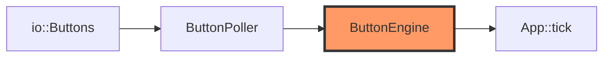

# buttons.rs

- **Path:** `core/src/buttons.rs`
- **Purpose:** Debounce and gesture recognition for REC and PWR — hold-to-record, long-press, double-tap — matching `pala_note` timings. `ButtonEngine` is pure timing logic; `ButtonPoller<B: Buttons>` wraps raw pin reads.

## Component in architecture



## Responsibilities

- **Does:** debounce, REC hold (≥350 ms), long (≥600 ms), double (≤200 ms window), idle-hold detect
- **Does not:** map gestures to `Transition` (App does); drive GPIO

## Key types / functions

| Item | Role |
|------|------|
| `DEFAULT_DEBOUNCE_MS` | `6` |
| `DEFAULT_REC_HOLD_MS` | `350` |
| `DEFAULT_LONG_MS` | `600` |
| `DEFAULT_DOUBLE_MS` | `200` |
| `ButtonEngine` | `new` / `with_timing`; `poll_rec_raw`, `poll_rec_release`, `poll_rec_double`, `poll_pwr_raw`, `poll_idle_rec_hold` |
| `ButtonPoller<B>` | `new`, `pins`/`pins_mut`, `rec_pressed` |

## Dependencies

- **Outbound:** `io::Buttons`, `state::ButtonEvent`
- **Inbound:** `app`, `zoop-sim`, `firmware::input`

## Tests

```bash
cargo test -p zoop-core buttons::tests
```

## Status

Host-verified; GPIO reads are HIL stubs on device.

## Related

[state.md](state.md), [../firmware/input/buttons.md](../firmware/input/buttons.md), [../architecture.md](../architecture.md)
