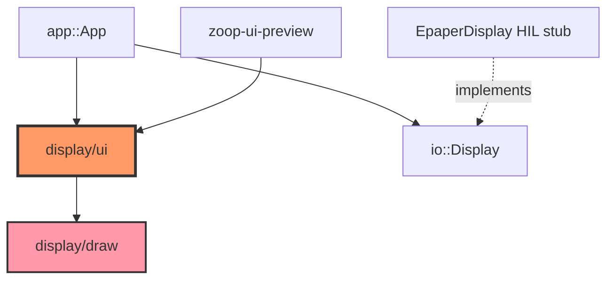

# Core display

Immediate-mode 200×200 1-bit UI for the e-Paper panel. `draw` provides primitives; `ui` maps `AppState` → screens via `UiContext::render`.

**Full screen catalog + preview instructions:** [../ui-capabilities.md](../ui-capabilities.md)

```bash
cargo run -p zoop-core --bin zoop-ui-preview
```

## Component in architecture



See [architecture.md](../../architecture.md).

## Capabilities at a glance

| Layer | Capabilities |
|-------|----------------|
| **draw** | Pixels, lines, rects, circles, 5×7 A–Z font, header/hints, battery ring |
| **ui** | 16 screens (Idle → Transcribing), inverted menu selection, 7-line transcript pages |
| **preview** | BMP + HTML gallery for visual QA on Mac |

## Child docs

| Doc | Source |
|-----|--------|
| [mod.md](mod.md) | `core/src/display/mod.rs` |
| [draw.md](draw.md) | `core/src/display/draw.rs` |
| [ui.md](ui.md) | `core/src/display/ui.rs` |
| [../bin/zoop_ui_preview.md](../bin/zoop_ui_preview.md) | Preview binary |
| [../ui-capabilities.md](../ui-capabilities.md) | Capability matrix |

## How components interact

`App::redraw` builds a `UiContext` over a framebuffer, calls `render(state)`, then flushes via `Display`. Firmware re-exports the same UI through `firmware/display`. Preview skips flush and writes BMPs instead.

## Status

Host-verified; SPI panel updates are HIL.
