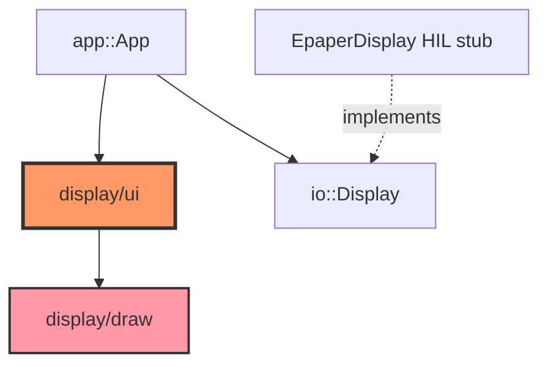

# Core display

Immediate-mode 200×200 1-bit UI for the e-Paper panel. `draw` provides primitives; `ui` maps `AppState` → screens via `UiContext::render`.

## Component in architecture

See [architecture.md](../../architecture.md).

## Child docs

| Doc | Source |
|-----|--------|
| [mod.md](mod.md) | `core/src/display/mod.rs` |
| [draw.md](draw.md) | `core/src/display/draw.rs` |
| [ui.md](ui.md) | `core/src/display/ui.rs` |

## How components interact

`App::redraw` builds a `UiContext` over a framebuffer, calls `render(state)`, then flushes via `Display::update_*`. Firmware re-exports the same UI through `firmware/display`.

## Status

Host-verified; SPI panel updates are HIL.
