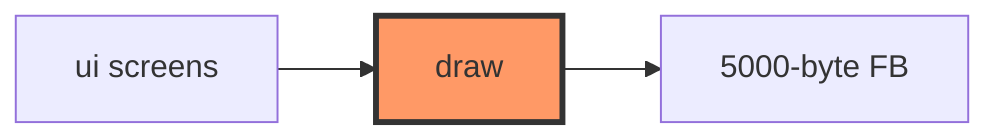

# display/draw.rs

- **Path:** `core/src/display/draw.rs`
- **Purpose:** 1-bit framebuffer primitives for 200×200 e-Paper — pixels, lines, circles, bitmap text, header/hints, battery ring. No panel I/O; operates on a `&mut [u8]` buffer.

## Component in architecture



## Responsibilities

- **Does:** geometry + text into buffer
- **Does not:** partial refresh scheduling or SPI

## Key types / functions

| Item | Role |
|------|------|
| `WIDTH`/`HEIGHT`/`BYTES` | 200 / 200 / 5000 |
| `BLACK`/`WHITE` | `0` / `1` |
| `set_pixel` / `get_pixel` | Bit addressing |
| `fill_rect`, `hline`, `vline`, `line` | Shapes |
| `fill_circle` / `stroke_circle` | Rings (battery) |
| `text_width`, `draw_str`, `draw_str_centered` | Bitmap font |
| `draw_header`, `draw_hints` | Chrome |
| `draw_battery_ring` | Idle battery UI |

## Constants / formats

MSB-first 1 bit/pixel packed rows.

## Dependencies

Outbound: none. Inbound: `ui`, tests.

## Tests

```bash
cargo test -p zoop-core display::draw::tests
```

## Status

Host-verified.

## Font capabilities

- Full **A–Z**, **0–9**, and punctuation: `. : - % # / ? ! + = _`
- Lowercase characters are mapped to uppercase when drawing
- Glyph size: 5×7 pixels (+ 1 px spacing)

## Related

[ui.md](ui.md) · [../ui-capabilities.md](../ui-capabilities.md) · [../bin/zoop_ui_preview.md](../bin/zoop_ui_preview.md) · [../../architecture.md](../../architecture.md)
