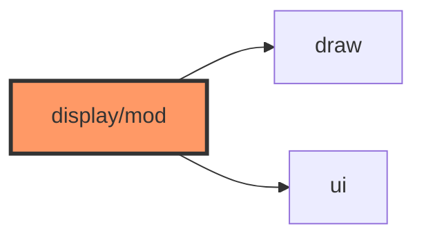

# display/mod.rs

- **Path:** `core/src/display/mod.rs`
- **Purpose:** Module root for display — re-exports `draw` and `ui` so callers can `use zoop_core::display::*`.

## Component in architecture

## Responsibilities

- **Does:** `pub mod draw/ui` + glob re-exports
- **Does not:** render logic

## Key types / functions

Re-exports everything public from [draw.md](draw.md) and [ui.md](ui.md).

## Dependencies

Outbound: `draw`, `ui`. Inbound: `app`, crate root.

## Tests

N/A (module glue).

## Status

Host-verified.

## Related

[README.md](README.md), [../../architecture.md](../../architecture.md)
