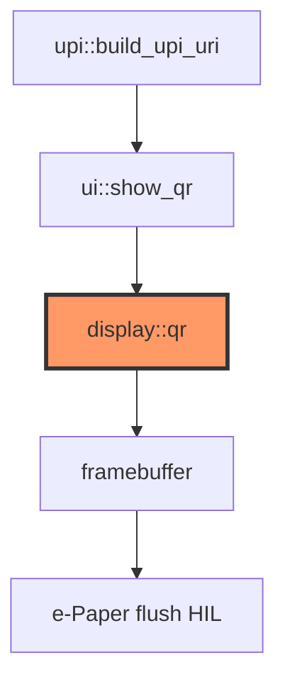

# display/qr.rs

- **Path:** `core/src/display/qr.rs`
- **Purpose:** Encode a string (typically a UPI URI) with the `qrcode` crate and paint black modules onto the 200×200 1-bit framebuffer, centered under the soft header.

## Component in architecture



## How QR works on this IoT e-Ink

1. Build payload: `upi://pay?pa=...&pn=...&am=...&cu=INR&tn=...`
2. `QrCode::new(payload)` → module grid
3. Scale modules to fit `QR_MAX_PX` (140) with a 2-module quiet zone
4. `fill_rect` each dark module in black
5. Firmware flushes the buffer to the Waveshare panel over SPI

Phones scan the **same pixels** the preview BMPs show. Full guide: [../ui-capabilities.md](../ui-capabilities.md#how-to-show-qr-codes-on-this-iot-e-ink-device).

## Key API

| Item | Role |
|------|------|
| `QR_MAX_PX` | Max QR square (140) |
| `draw_qr_centered(buf, payload, top_y)` | Encode + draw; returns module width |
| `qr_fits_panel(payload)` | Quick size check before showing UI |

## Dependencies

Outbound: `draw`, `error`, `qrcode`. Inbound: `ui` (Show QR screen), tests, preview.

## Tests

```bash
cargo test -p zoop-core display::qr::
```

## Status

Host-verified. Panel SPI flush is HIL.

## Related

[ui.md](ui.md) · [../upi.md](../upi.md) · [../ui-capabilities.md](../ui-capabilities.md)
