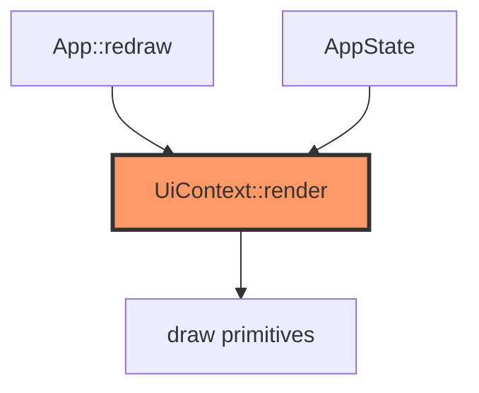

# display/ui.rs

- **Path:** `core/src/display/ui.rs`
- **Purpose:** Screen composers for each `AppState` — idle with battery ring, recording, menus, note list/detail, transfer IP, wifi/transcribe progress, errors, sleep. Returns `ScreenId` so `App` can skip redundant full refreshes.

## Component in architecture



## Responsibilities

- **Does:** clear + paint screens; expose `ScreenId` and overlay helpers (`show_error_screen`, `show_battery_low`, `show_ultra_sleep`, `show_wifi_connecting`, `show_transcribing`)
- **Does not:** handle buttons or storage

## Key types / functions

| Item | Role |
|------|------|
| `HEADER_H` / `HINTS_Y` | Layout constants `28` / `180` |
| `clear_screen` | Fill white |
| `ScreenId` | Idle, Recording, Saved, TagSelect, Menu, Settings, DeviceInfo, NoteList, NoteDetail, DeleteConfirm, Transfer, BatteryLow, Error, UltraSleep, WifiConnecting, Transcribing |
| `UiContext` | buf, battery, version, indices, tags, list/detail fields, transfer_ip, transcribe counters, sounds_on |
| `render(state)` | Dispatch to `show_*` |

## Dependencies

Outbound: `draw`, `state::AppState`. Inbound: `app`.

## Tests

```bash
cargo test -p zoop-core display::ui::tests
```

## Status

Host-verified.

## Related

[draw.md](draw.md), [../state.md](../state.md), [../../architecture.md](../../architecture.md)
