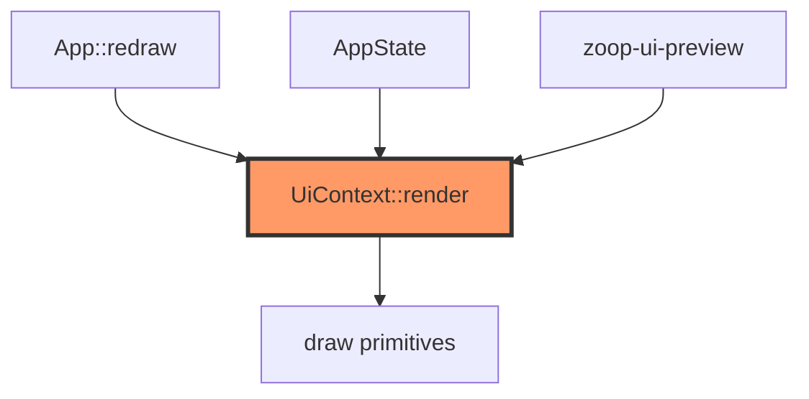

# display/ui.rs

- **Path:** `core/src/display/ui.rs`
- **Purpose:** Screen composers for each `AppState` — idle with battery ring, recording, menus, note list/detail, transfer IP, wifi/transcribe progress, errors, sleep. Returns `ScreenId` so `App` can track what was painted. Full capability matrix: [../ui-capabilities.md](../ui-capabilities.md).

## Component in architecture



## Responsibilities

- **Does:** clear + paint screens; expose `ScreenId` and overlays (`show_error_screen`, `show_battery_low`, `show_ultra_sleep`, `show_wifi_connecting`, `show_transcribing`)
- **Does not:** handle buttons, storage, or SPI flush (that is `App` + `Display` trait)

## Screen capabilities (summary)

| ScreenId | Highlights |
|----------|------------|
| Idle | Brand, note count, mic icon, battery ring + % |
| Recording | Large record glyph, release hint |
| Saved / TagSelect | Post-record tagging flow |
| Menu / Settings | Inverted selection row |
| DeviceInfo | FW, battery, RTC, notes |
| NoteList / NoteDetail | Filter, `#NNN`, 7 transcript lines/page |
| DeleteConfirm | Confirm destructive delete |
| Transfer | Portal active + LAN IP |
| Error / BatteryLow / UltraSleep | Status overlays |
| WifiConnecting / Transcribing | Sync progress |

See the full table and hint labels in [ui-capabilities.md](../ui-capabilities.md).

## Key types / functions

| Item | Role |
|------|------|
| `HEADER_H` / `HINTS_Y` | Layout constants `28` / `180` |
| `clear_screen` | Fill white (`0xFF`) |
| `ScreenId` | 16 screen identities (Idle … Transcribing) |
| `UiContext` | Framebuffer + all dynamic labels (battery, tags, IP, …) |
| `render(state)` | Dispatch to private `show_*` for `AppState` |
| `show_error_screen` / `show_battery_low` / `show_ultra_sleep` / `show_wifi_connecting` / `show_transcribing` | Overlays callable outside normal state match |

## Visual QA

```bash
cargo run -p zoop-core --bin zoop-ui-preview
open target/ui-preview/index.html
```

## Dependencies

Outbound: `draw`, `state::AppState`. Inbound: `app`, `zoop-ui-preview`.

## Tests

```bash
cargo test -p zoop-core display::ui::tests
```

Idle/menu render, error message, stable idle framebuffer hash.

## Status

Host-verified. Panel SPI refresh is HIL ([../../firmware/display/epaper.md](../../firmware/display/epaper.md)).

## Related

[draw.md](draw.md) · [../ui-capabilities.md](../ui-capabilities.md) · [../bin/zoop_ui_preview.md](../bin/zoop_ui_preview.md) · [../state.md](../state.md) · [../../architecture.md](../../architecture.md)
