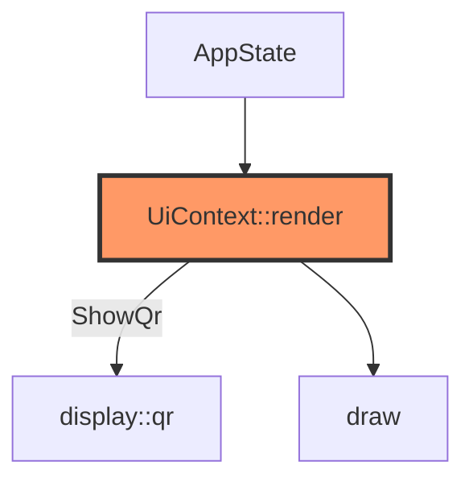

# display/ui.rs (UPI Pay)

- **Path:** `core/src/display/ui.rs`
- **Purpose:** Immediate-mode **UPI payment** screens for 200×200 e-Paper — home, QR, waiting, success, history, merchant, settings. Maps `AppState` button flow onto payment visuals.

Full catalog: [../ui-capabilities.md](../ui-capabilities.md).

## Component in architecture



## Key screens

| ScreenId | AppState | Content |
|----------|----------|---------|
| Idle | Idle | ZOOP PAY home |
| ShowQr | Recording | UPI QR via `draw_qr_centered` |
| Waiting | Saved | Checking payment |
| Success | TagSelect | Paid + check |
| Menu / History / Merchant / … | Menu / NoteList / Transfer / … | Navigation |

## `UiContext` payment fields

`merchant_name`, `upi_vpa`, `amount_inr`, `upi_uri`, `txn_note`, `txn_count`, `history_lines`, …

## Preview

```bash
cargo run -p zoop-core --bin zoop-ui-preview
```

## Status

Host-verified UI. Payment confirmation backend + real e-Paper flush are HIL / product next steps.

## Related

[qr.md](qr.md) · [../ui-capabilities.md](../ui-capabilities.md) · [../upi.md](../upi.md)
