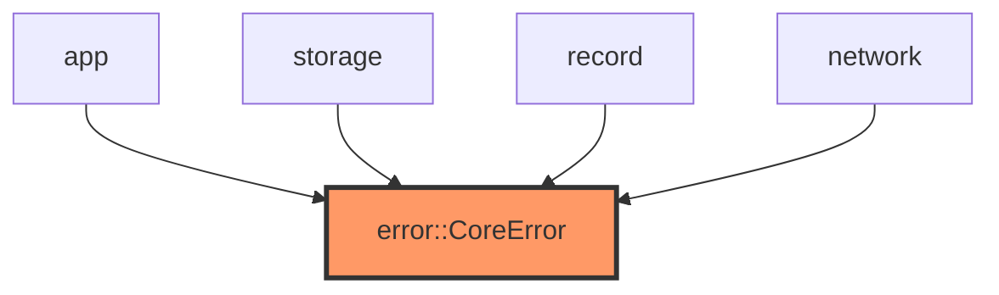

# error.rs

- **Path:** `core/src/error.rs`
- **Purpose:** Shared error type for host-testable core logic. Every fallible core API returns `CoreResult<T>` so firmware and tests share one error taxonomy (storage, I/O, state, audio, network).

## Component in architecture

## Responsibilities

- **Does:** `CoreError` variants + `Display`/`Error` impls; `CoreResult` alias
- **Does not:** logging, panic handling, ESP-IDF error conversion

## Key types / functions

| Item | Role |
|------|------|
| `CoreResult<T>` | `Result<T, CoreError>` |
| `CoreError` | `Storage`, `InvalidIndexLine`, `InvalidTag`, `TagNotFound`, `TagLimitReached`, `NoteNotFound`, `InvalidWav`, `InvalidTransition`, `InvalidMeta` |

## Dependencies

- **Outbound:** none (leaf)
- **Inbound:** nearly all core modules; firmware propagates via `CoreResult`

## Tests

No dedicated module tests; exercised whenever APIs return `Err`.

## Status

Host-verified.

## Related

[lib.md](lib.md), [../architecture.md](../architecture.md)
