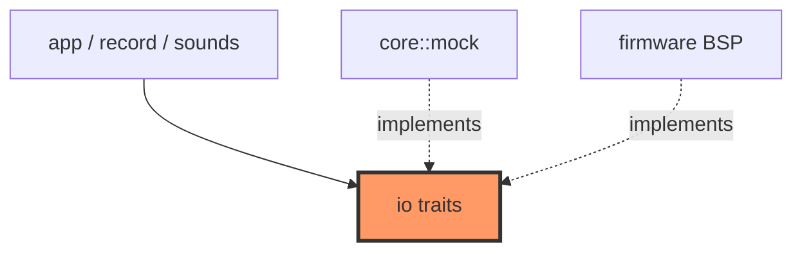

# io.rs

- **Path:** `core/src/io.rs`
- **Purpose:** Trait boundary between pure app logic and hardware. Host mocks and firmware BSP adapters both implement these traits so `App` stays free of ESP-IDF types. Covers e-Paper framebuffer flush, audio record/playback/beeps, buttons, power rails, clock, time source, battery ADC, and debounced button events.

## Component in architecture

## Responsibilities

- **Does:** define `Display`, `Audio`, `Buttons`, `PowerRails`, `Clock`, `TimeSource`, `BatteryAdc`, `ButtonEvents`; `SoundKind` enum
- **Does not:** implement drivers (see `mock` / firmware)

## Key types / functions

| Trait / type | Role |
|--------------|------|
| `Display` | `flush`, `framebuffer_mut`, `width`, `height` |
| `Audio` | `set_volume`, `play_beep`, `start_record`/`stop_record`, `read_record_chunk`, `start_playback`/`stop_playback`, `is_playing` |
| `Buttons` | `rec_pressed`, `pwr_pressed` (active LOW on hardware) |
| `PowerRails` | battery hold, EPD/audio on/off, `logged_sequence` |
| `SoundKind` | `Select`, `Next`, `Back`, `Saved`, `Delete`, `Success`, `Error` |
| `Clock` | `now_ms()` monotonic |
| `TimeSource` | `utc_iso` / `set_utc_iso` |
| `BatteryAdc` | `read_mv_samples(count)` |
| `ButtonEvents` | `poll_rec`, `poll_pwr`, `idle_rec_hold_started` |

## Dependencies

- **Outbound:** `error::CoreResult`, `state::ButtonEvent`
- **Inbound:** `app`, `record`, `sounds`, `power`, `mock`, all firmware BSP modules

## Tests

Trait contracts covered via mocks in app/record/integration tests.

## Status

Host-verified (mock impls); firmware impls are HIL stubs.

## Related

[mock.md](mock.md), [../firmware/README.md](../firmware/README.md), [../architecture.md](../architecture.md)
