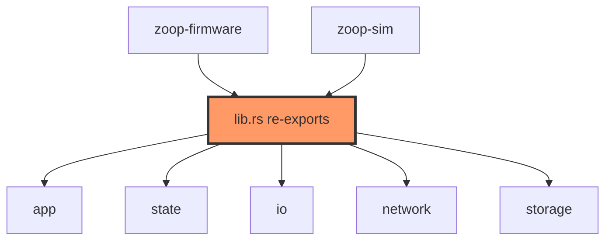

# lib.rs

- **Path:** `core/src/lib.rs`
- **Purpose:** Crate root for `zoop-core`. Declares all public modules and re-exports the surfaces that firmware, `zoop-sim`, and integration tests commonly need so callers can `use zoop_core::{App, ...}` without deep paths. It does not contain application logic itself.

## Component in architecture

## Responsibilities

- **Does:** module tree, public re-exports
- **Does not:** runtime behavior, BSP, secrets

## Key types / functions

Re-exports (selected):

| Export | Source |
|--------|--------|
| `App` | `app` |
| `BatteryCurve`, `battery_percent_from_voltage` | `battery` |
| `ButtonEngine` | `buttons` |
| `CoreError`, `CoreResult` | `error` |
| `Display`, `Audio`, `Buttons`, `Clock`, … | `io` |
| `handle_portal_request`, `serve_portal`, `HttpRequest`, `HttpResponse` | `network::portal` |
| `transcribe_all`, `transcribe_note`, `HttpClient` | `network::whisper` |
| `advance_wifi_connect`, `WifiConnectPhase`, `WifiMode` | `network::wifi` |
| path constants / `note_path` | `paths` |
| `format_export_text`, `portal_css`, … | `portal_fmt` |
| `power_on_sequence`, `power_sleep_sequence` | `power` |
| `RecordSession`, `RecordOutcome` | `record` |
| `ActivityTimer`, `WakeCause` | `sleep` |
| `SoundsPolicy` | `sounds` |
| `AppState`, `ButtonEvent`, `StateMachine`, `Transition` | `state` |
| `MerchantProfile`, `PaymentRequest`, `PaymentLedger`, … | `payment` |
| `build_upi_uri`, `format_amount_label` | `upi` |
| storage types | `storage` |
| `TimeSyncState`, `NTP_SERVERS` | `time` |
| transcription config / helpers | `transcribe` |
| `WavHeader`, `parse_wav_header`, `SAMPLE_RATE` | `wav` |
| `parse_whisper_text` | `whisper_parse` |

## Dependencies

- **Outbound:** all `core` modules listed above
- **Inbound:** firmware crate, `zoop-sim`, integration tests

## Tests

No unit tests in `lib.rs`. Covered indirectly by crate-wide tests: `cargo test -p zoop-core`.

## Status

Host-verified (re-export surface used by CI tests).

## Related

[README.md](README.md), [app.md](app.md), [../architecture.md](../architecture.md)
