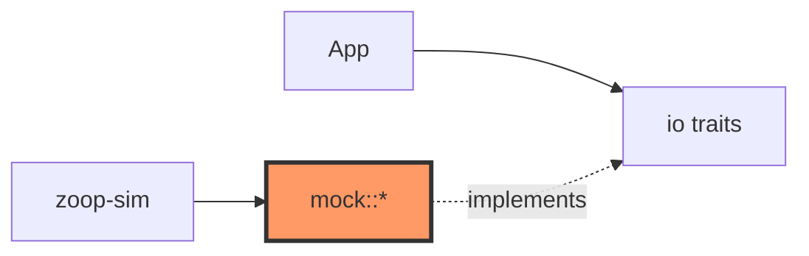

# mock.rs

- **Path:** `core/src/mock.rs`
- **Purpose:** In-memory BSP fakes for host tests and `zoop-sim`. Provides a 200×200 1-bit framebuffer display, scriptable buttons, power-rail log, PCM audio queue, clock/time, and battery ADC with fixed voltage — no hardware required.

## Component in architecture

## Responsibilities

- **Does:** implement `Display`, `Buttons`, `PowerRails`, `Audio`, `Clock`, `TimeSource`, `BatteryAdc`; framebuffer hash helpers; `ButtonSchedule`; `MockFileRegistry`
- **Does not:** persist to real disk (`storage::MockStorage` does); talk to ESP-IDF

## Key types / functions

| Item | Role |
|------|------|
| `EPD_WIDTH` / `EPD_HEIGHT` / `FRAMEBUFFER_BYTES` | 200×200 / 5000 bytes |
| `MockDisplay` | `new`, `hash`, `is_solid` |
| `MockButtons` | settable `rec` / `pwr` |
| `MockPowerRails` | records sequence strings |
| `MockAudio` | `push_pcm`, record/play stubs |
| `MockClock` / `MockTime` | injectable time |
| `MockBatteryAdc::with_voltage` | fixed pack voltage |
| `ButtonSchedule::apply_at` | script presses at `now_ms` |
| `MockFileRegistry` | path→bytes map helper |

## Constants / formats

- Framebuffer: `(200*200)/8 = 5000` bytes, 1 bit/pixel

## Dependencies

- **Outbound:** `io`, `error`
- **Inbound:** unit tests, `zoop-sim`, integration tests

## Tests

Exercised indirectly; no large dedicated suite beyond type usage in other modules.

## Status

Host-verified.

## Related

[io.md](io.md), [storage/mock.md](storage/mock.md), [bin/zoop_sim.md](bin/zoop_sim.md), [../architecture.md](../architecture.md)
