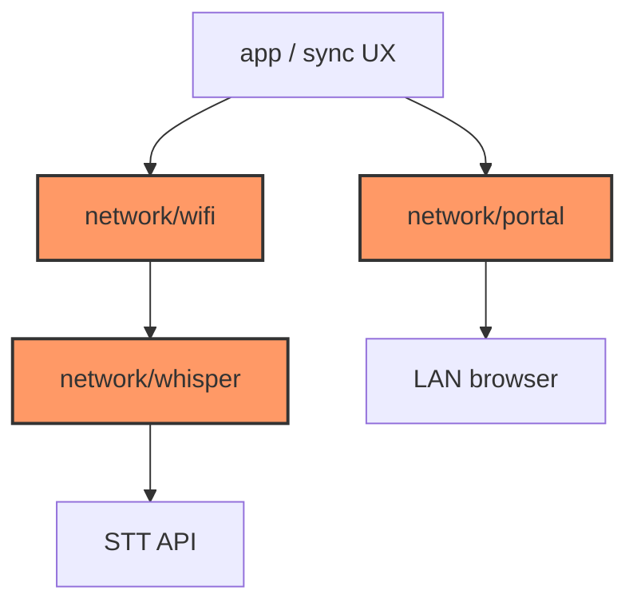

# Core network

Host-testable WiFi connect policy, Whisper transcription orchestration, and HTTP transfer portal handlers. Firmware supplies TLS/HTTP/WiFi stacks as HIL stubs wrapping these APIs.

## Component in architecture

[architecture.md](../../architecture.md).

## Child docs

| Doc | Source |
|-----|--------|
| [mod.md](mod.md) | `mod.rs` |
| [wifi.md](wifi.md) | `wifi.rs` |
| [portal.md](portal.md) | `portal.rs` |
| [whisper.md](whisper.md) | `whisper.rs` |

## How components interact

Sync: `advance_wifi_connect` → Connected → `transcribe_all` → optional Transfer mode with `handle_portal_request` / `serve_portal`.

## Status

Host-verified; device networking is HIL stub.
