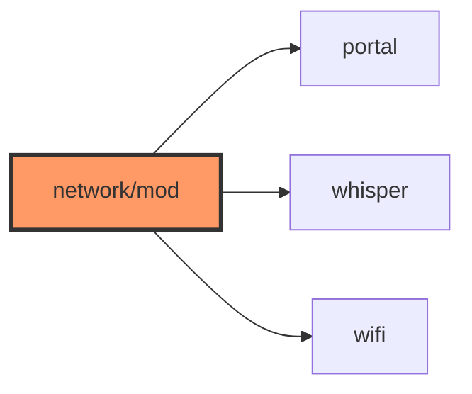

# network/mod.rs

- **Path:** `core/src/network/mod.rs`
- **Purpose:** Re-exports portal, whisper, and wifi submodules.

## Component in architecture

## Responsibilities

Module glue + glob re-exports.

## Key types / functions

See child docs.

## Dependencies

Outbound: portal, whisper, wifi. Inbound: `lib.rs`, app sync paths.

## Status

Host-verified.

## Related

[README.md](README.md), [../../architecture.md](../../architecture.md)
