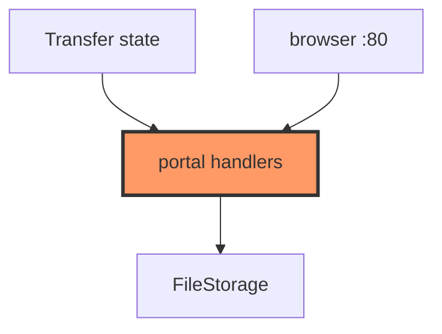
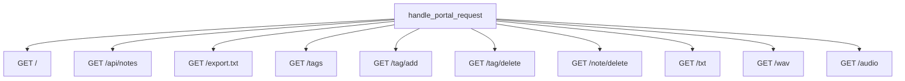

# network/portal.rs

- **Path:** `core/src/network/portal.rs`
- **Purpose:** Pure HTTP request handlers for Transfer mode — list/download notes, export, tag CRUD — ported from `pala_note` portal routes. `serve_portal` loops a callback for host tests; firmware will wrap with `esp-idf` HTTP server.

## Component in architecture



## Responsibilities

- **Does:** parse query, dispatch routes, build `HttpResponse` (HTML/JSON/file/redirect)
- **Does not:** bind sockets (firmware HIL)

## Key types / functions

| Item | Role |
|------|------|
| `PORTAL_TITLE` | `"zoop portal"` |
| `HttpRequest` | method, path, body, headers |
| `HttpResponse` | status, headers, body; `html`/`json`/`text`/`redirect`/`not_found`/`bad_request`/`file` |
| `parse_query` / `query_param` | Path + query helpers |
| `handle_portal_request(storage, index, tags, req)` | Route dispatch |
| `serve_portal(...)` | Test/server loop helper |

## Data / control flow — HTTP routes



## Dependencies

Outbound: `storage`, `portal_fmt`, `paths`, `error`. Inbound: tests, firmware `TransferPortal` (future wiring).

## Tests

```bash
cargo test -p zoop-core network::portal::tests
```

## Status

Host-verified; device HTTP server HIL stub.

## Related

[../portal_fmt.md](../portal_fmt.md), [../../firmware/network/portal.md](../../firmware/network/portal.md), [../../architecture.md](../../architecture.md)
