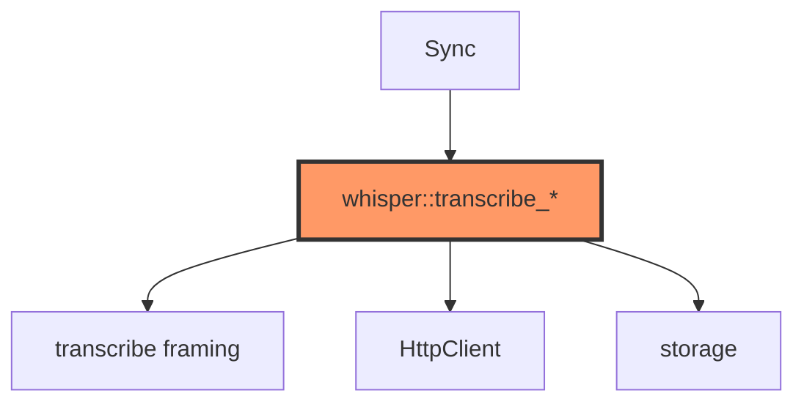
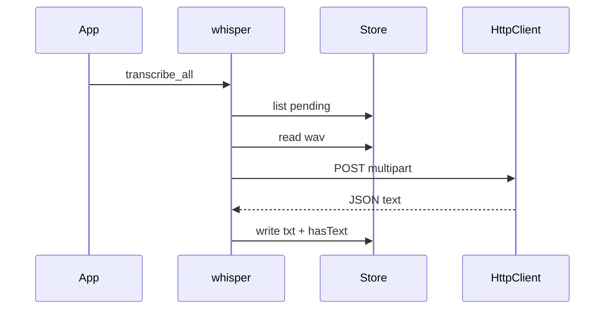

# network/whisper.rs

- **Path:** `core/src/network/whisper.rs`
- **Purpose:** Upload pending WAVs via injectable `HttpClient`, write `.txt`, and mark `hasText` in the index. Retries/timeouts are policy constants; TLS is supplied by the client impl (mock on host, ESP-TLS on device later).

## Component in architecture



## Responsibilities

- **Does:** `transcribe_note`, `pending_transcription`, `transcribe_all`; retry policy
- **Does not:** WiFi associate or parse beyond `transcribe` helpers

## Key types / functions

| Item | Role |
|------|------|
| `CHUNK_SIZE` | `4096` |
| `MAX_RETRIES` | `3` |
| `RETRY_DELAY_MS` | `3000` |
| `REQUEST_TIMEOUT_MS` | `90_000` |
| `HttpClient` | Trait for POST multipart |
| `transcribe_note` | One note |
| `pending_transcription` | Index rows without text |
| `transcribe_all` | Batch pending |

## Data / control flow



## Dependencies

Outbound: `transcribe`, `storage`, `error`. Inbound: app sync, firmware `WhisperClient`.

## Tests

```bash
cargo test -p zoop-core network::whisper::tests
```

## Status

Host-verified; ESP-TLS upload HIL stub.

## Related

[../transcribe.md](../transcribe.md), [wifi.md](wifi.md), [../../architecture.md](../../architecture.md)
