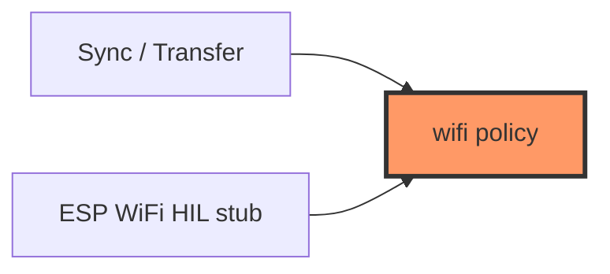

# network/wifi.rs

- **Path:** `core/src/network/wifi.rs`
- **Purpose:** Pure connect/retry state machine for Sync vs Transfer modes — attempt caps and retry delays without ESP-IDF WiFi types. Firmware `WifiManager::connect_step` delegates here.

## Component in architecture



## Responsibilities

- **Does:** phase enum, `advance_wifi_connect`, `post_sync_policy`
- **Does not:** scan/associate radios

## Key types / functions

| Item | Role |
|------|------|
| `WifiMode` | Sync vs Transfer policy mode |
| `WifiConnectPhase` | Idle / Connecting / Connected / Failed (see source) |
| `SYNC_MAX_ATTEMPTS` | `20` |
| `SYNC_RETRY_MS` | `500` |
| `TRANSFER_MAX_ATTEMPTS` | `24` |
| `advance_wifi_connect(phase, connected, elapsed_ms, retry_ms, max)` | Step machine |
| `post_sync_policy()` | Mode after sync |

## Dependencies

Outbound: none. Inbound: app sync UX, firmware wifi.

## Tests

```bash
cargo test -p zoop-core network::wifi::tests
```

## Status

Host-verified; STA HIL stub.

## Related

[whisper.md](whisper.md), [../../../firmware/network/wifi.md](../../firmware/network/wifi.md), [../../architecture.md](../../architecture.md)
