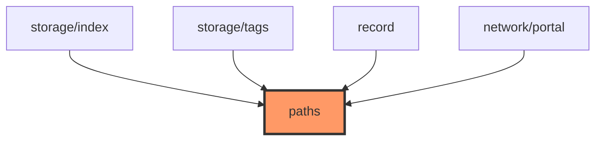

# paths.rs

- **Path:** `core/src/paths.rs`
- **Purpose:** Canonical relative paths and tag limits shared by storage, portal, and recording. Keeps `notes/index.csv`, tag file names, and `note_NNN.ext` formatting consistent between host mocks and on-device SD layout (firmware may prefix mount root separately).

## Component in architecture

## Responsibilities

- **Does:** constants for notes dir, index/tag files + `.tmp` siblings, tag limits, default tags, `note_path`
- **Does not:** mount SD, create directories (callers do)

## Key types / functions

| Item | Role |
|------|------|
| `NOTES_DIR` | `"notes"` |
| `INDEX_FILE` / `INDEX_TMP` | `notes/index.csv` / `.tmp` |
| `TAG_FILE` / `TAG_TMP` | `notes/tags.txt` / `.tmp` |
| `MAX_TAGS` | `20` |
| `MAX_TAG_LEN` | `31` |
| `DEFAULT_TAGS` | Note, Work, Idea, Buy, Private |
| `note_path(num, ext)` | e.g. `notes/note_001.wav` |

## Constants / formats

See table above. Note numbering zero-padded in `note_path`.

## Dependencies

- **Outbound:** none
- **Inbound:** storage, record, portal, app, firmware `board::config` (parallel absolute paths)

## Tests

Used by storage/record tests; no dedicated `paths::tests`.

## Status

Host-verified.

## Related

[storage/index.md](storage/index.md), [../firmware/board/config.md](../firmware/board/config.md), [../architecture.md](../architecture.md)
