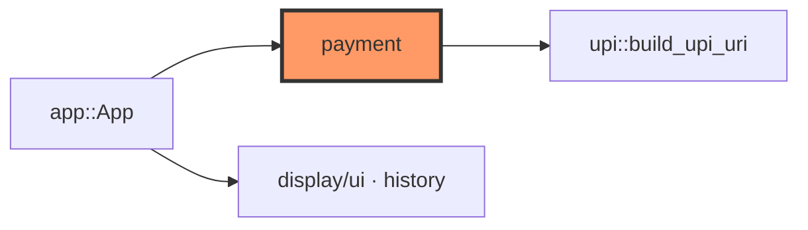

# payment.rs

- **Path:** `core/src/payment.rs`
- **Purpose:** Domain models for Zoop Pay — merchant identity, active collect request (UPI URI + status), and an in-memory payment ledger for history until SD persistence lands.

## Component in architecture



## Responsibilities

- **Does:** build `PaymentRequest` from `MerchantProfile`, track `PaymentStatus`, assign txn numbers, history labels
- **Does not:** draw QR, talk to banks, persist to SD (yet)

## Key types / functions

| Item | Role |
|------|------|
| `MerchantProfile` | `name`, `vpa` (default Akash Soni / `akash@oksbi`) |
| `PaymentStatus` | `Draft`, `QrShown`, `Pending`, `Paid`, `Failed`, `Cancelled` |
| `PaymentRequest` | Active collect: amount, note, URI, status helpers |
| `PaymentRecord` | Settled row + `list_label()` |
| `PaymentLedger` | `push_paid`, `next_num`, `history_labels` |

## Dependencies

- **Outbound:** `upi`
- **Inbound:** `app`, docs / preview sample data

## Tests

```bash
cargo test -p zoop-core payment::tests
```

## Status

Host-verified (in-memory).

## Related

[upi.md](upi.md), [app.md](app.md), [state.md](state.md), [display/qr.md](display/qr.md)
