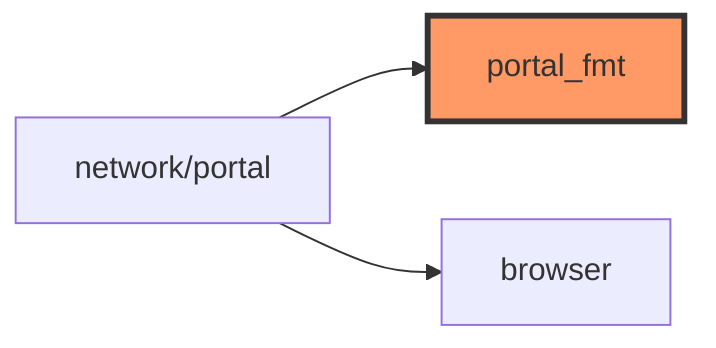

# portal_fmt.rs

- **Path:** `core/src/portal_fmt.rs`
- **Purpose:** HTML/text formatting helpers for the transfer portal — CSS, HTML escape, URL decode, export `.txt` bundling with size cap. Keeps `network::portal` handlers thin.

## Component in architecture



## Responsibilities

- **Does:** escape, export text, filenames, CSS, simple URL decode
- **Does not:** route dispatch or TCP listen

## Key types / functions

| Item | Role |
|------|------|
| `EXPORT_MAX_BYTES` | `55_000` |
| `html_escape` | Entity escape |
| `ExportNote` | num/tag/body for export |
| `format_export_text` / `format_note_heading` | Build export body |
| `export_filename` | Download name from filter |
| `url_decode_simple` | Query decoding |
| `portal_css` | Embedded stylesheet string |

## Dependencies

- **Outbound:** none significant
- **Inbound:** `network/portal`

## Tests

```bash
cargo test -p zoop-core portal_fmt::tests
```

## Status

Host-verified.

## Related

[network/portal.md](network/portal.md), [../architecture.md](../architecture.md)
