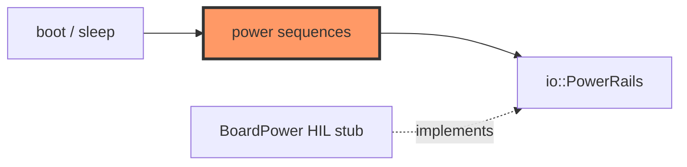

# power.rs

- **Path:** `core/src/power.rs`
- **Purpose:** Ordered power-rail sequences for boot and sleep — battery hold, e-Paper rail, audio rail — as pure policy over `PowerRails`. Firmware `BoardPower` logs the same order until GPIO is wired.

## Component in architecture



## Responsibilities

- **Does:** `power_on_sequence`, `power_sleep_sequence`, sequence match helper for tests
- **Does not:** toggle GPIO

## Key types / functions

| Item | Role |
|------|------|
| `POWER_ON_SEQUENCE` | `battery_hold_on` → `epd_power_on` → `audio_power_on` (see source) |
| `POWER_SLEEP_SEQUENCE` | `audio_power_off`, `epd_power_off`, `battery_hold_on` |
| `power_on_sequence(power)` | Apply on sequence |
| `power_sleep_sequence(power)` | Apply sleep sequence |
| `sequence_matches(log, expected)` | Test helper |

## Dependencies

- **Outbound:** `io::PowerRails`
- **Inbound:** firmware `board::power`, unit tests

## Tests

```bash
cargo test -p zoop-core power::tests
```

## Status

Host-verified; GPIO HIL stub.

## Related

[io.md](io.md), [../firmware/board/power.md](../firmware/board/power.md), [../architecture.md](../architecture.md)
