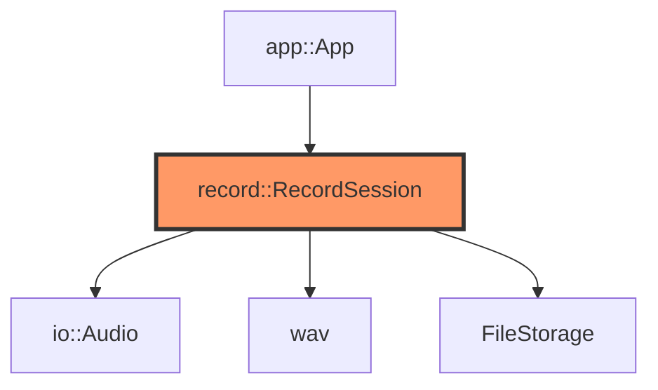
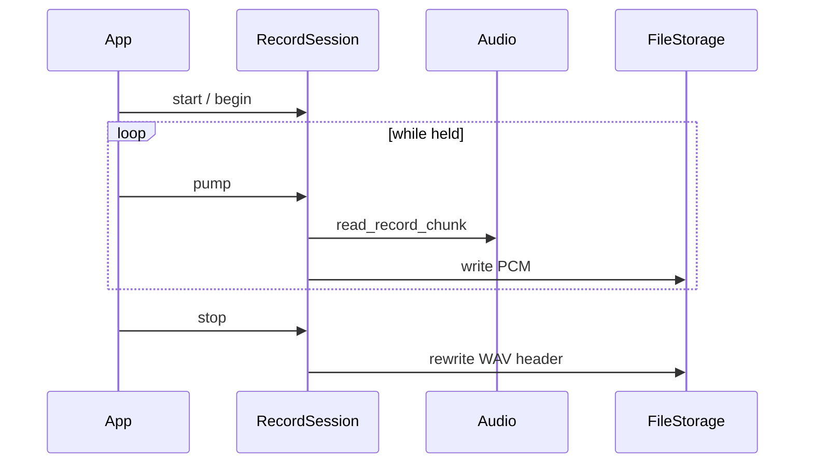

# record.rs

- **Path:** `core/src/record.rs`
- **Purpose:** Streaming note capture to WAV on storage. Opens a note file with a placeholder header, pumps PCM chunks from `Audio`, then finalizes duration/header and index metadata. Enforces minimum duration/byte thresholds so accidental taps do not create empty notes.

## Component in architecture



## Responsibilities

- **Does:** start/begin/pump/stop session; finalize new note; duration from mono bytes
- **Does not:** tag UI, transcription upload

## Key types / functions

| Item | Role |
|------|------|
| `MIN_MONO_BYTES` | `1000` |
| `MIN_RECORD_MS` | `500` |
| `RecordOutcome` | Success / too-short / error outcomes |
| `RecordSession::start(num)` | Create session for note number |
| `begin(audio, storage)` | Start codec + open file |
| `pump(audio, storage)` | Read chunk, append |
| `stop(...)` | Finalize WAV + outcome |
| `finalize_new_note` | Header rewrite / index hook helper |
| `duration_ms_from_mono_bytes` | PCM length → ms @ 16 kHz mono |

## Data / control flow



## Dependencies

- **Outbound:** `wav`, `io::Audio`, `storage::FileStorage`, `paths`, `error`
- **Inbound:** `app`

## Constants / formats

- 16 kHz mono PCM (via `wav::SAMPLE_RATE`); min 500 ms / 1000 bytes

## Tests

```bash
cargo test -p zoop-core record::tests
```

## Status

Host-verified; ES8311 + SD write are HIL.

## Related

[wav.md](wav.md), [app.md](app.md), [../architecture.md](../architecture.md)
