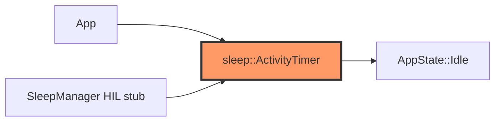

# sleep.rs

- **Path:** `core/src/sleep.rs`
- **Purpose:** Activity timer and ultra-sleep policy for Idle, plus battery-warning overlay timing. Firmware `SleepManager` calls into this; actual `esp_deep_sleep` is HIL.

## Component in architecture



## Responsibilities

- **Does:** track last activity; decide ultra-sleep; battery warning overlay window; `WakeCause` from pin holds
- **Does not:** enter deep sleep hardware

## Key types / functions

| Item | Role |
|------|------|
| `DEFAULT_ULTRA_SLEEP_MS` | `120_000` |
| `BAT_WARN_OVERLAY_MS` | `2_500` |
| `ActivityTimer` | `new`, `reset_activity`, `idle_ms`, `should_ultra_sleep`, battery warning APIs |
| `WakeCause` | wake reason enum |
| `wake_cause_from_pins(rec_held, pwr_held)` | Map held buttons to wake |

## Dependencies

- **Outbound:** `state::AppState`, `battery` thresholds conceptually
- **Inbound:** `app`, `firmware::power::sleep`

## Tests

```bash
cargo test -p zoop-core sleep::tests
```

## Status

Host-verified; ext1 wake HIL stub.

## Related

[battery.md](battery.md), [../firmware/power/sleep.md](../firmware/power/sleep.md), [../architecture.md](../architecture.md)
