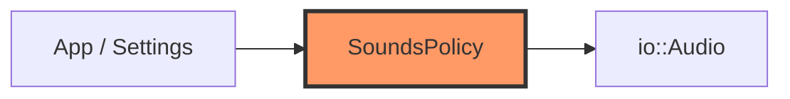

# sounds.rs

- **Path:** `core/src/sounds.rs`
- **Purpose:** Optional UI sound feedback policy. When enabled, maps `SoundKind` to `Audio::play_beep`; keeps a last-event log for tests. Settings toggle drives `set_enabled`.

## Component in architecture



## Responsibilities

- **Does:** enable flag, play, last_event log
- **Does not:** synthesize waveforms (BSP/audio does)

## Key types / functions

| Item | Role |
|------|------|
| `SoundsPolicy::new(enabled)` | Construct |
| `set_enabled` | Settings toggle |
| `play(audio, kind)` | Conditionally play |
| `last_event` / `clear_log` | Test inspection |

## Dependencies

- **Outbound:** `io::{Audio, SoundKind}`
- **Inbound:** `app`, firmware re-export

## Tests

```bash
cargo test -p zoop-core sounds::tests
```

## Status

Host-verified; speaker path HIL.

## Related

[io.md](io.md), [app.md](app.md), [../architecture.md](../architecture.md)
