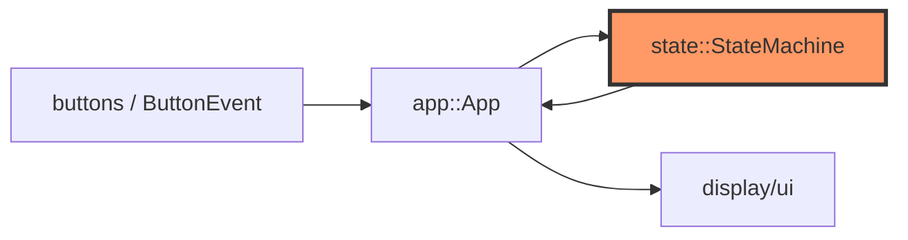
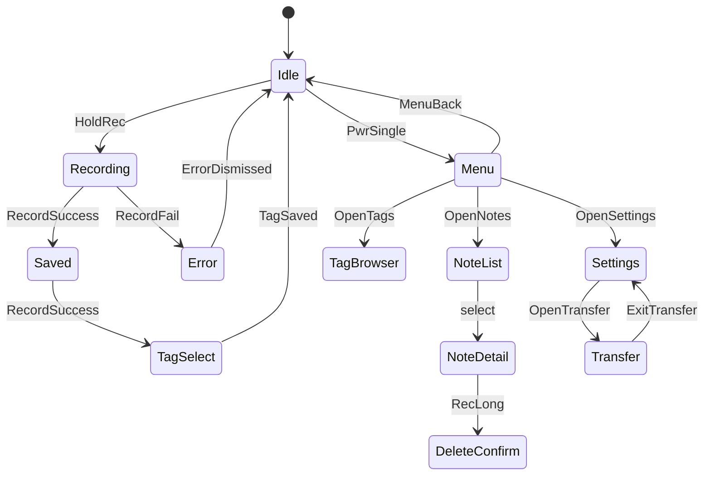

# state.rs

- **Path:** `core/src/state.rs`
- **Purpose:** Typed UX state machine for Zoop. Maps high-level `Transition` events (button semantics, record success/fail, menu opens) onto `AppState` without stringly-typed screens. `App` owns a `StateMachine` and drives all navigation through `apply`.

## Component in architecture



## Responsibilities

- **Does:** validate transitions, track `last_rec_num`, activity-reset flag
- **Does not:** draw pixels, touch storage, start audio

## Key types / functions

| Item | Role |
|------|------|
| `AppState` | `Idle`, `Recording`, `Saved`, `TagSelect`, `Menu`, `TagBrowser`, `NoteList`, `NoteDetail`, `DeleteConfirm`, `Settings`, `DeviceInfo`, `Transfer`, `Error` |
| `ButtonEvent` | `None`, `Single`, `Long`, `Double` |
| `Transition` | `HoldRec`, `ReleaseRec`, `RecSingle/Long/Double`, `PwrSingle/Double`, `RecordSuccess/Fail`, `TagSaved`, menu opens, delete, wake, … |
| `StateMachine::new` | Start in `Idle` |
| `state()` / `set_last_rec_num` | Inspect / record last note number |
| `apply(event)` | Transition or `CoreError` if illegal |
| `take_activity_reset()` | Consume flag set by activity-producing transitions |

## Data / control flow



## Dependencies

- **Outbound:** `error`
- **Inbound:** `app`, `sleep` (idle-only ultra sleep), UI render match, firmware re-exports

## Tests

```bash
cargo test -p zoop-core state::tests
```

Idle→record→tag, menu navigation, illegal transitions, activity reset.

## Status

Host-verified.

## Related

[app.md](app.md), [buttons.md](buttons.md), [../architecture.md](../architecture.md)
