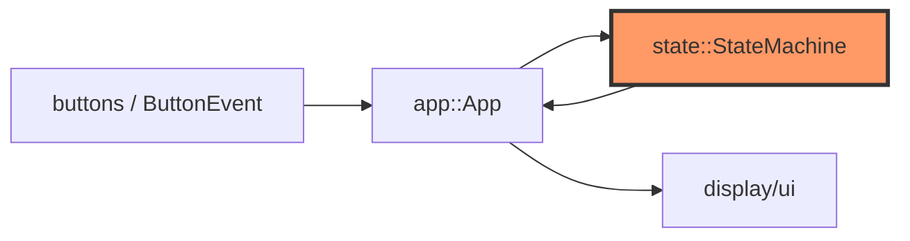
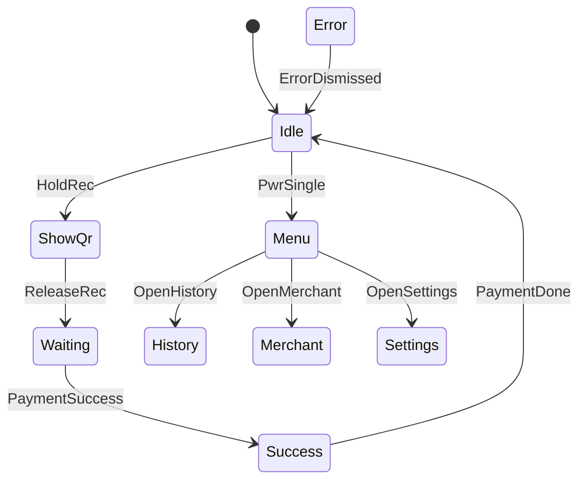

# state.rs

- **Path:** `core/src/state.rs`
- **Purpose:** Typed UPI payment state machine for Zoop Pay. Maps `Transition` events (button semantics, payment pending/success/fail, menu opens) onto `AppState`. `App` owns a `StateMachine` and drives navigation only through `apply`.

## Component in architecture



## Responsibilities

- **Does:** validate transitions, track `last_txn_num`, activity-reset flag
- **Does not:** draw pixels, touch storage, build UPI URIs

## Key types / functions

| Item | Role |
|------|------|
| `AppState` | `Idle`, `ShowQr`, `Waiting`, `Success`, `Menu`, `History`, `HistoryDetail`, `CancelConfirm`, `Settings`, `DeviceInfo`, `Merchant`, `Error` |
| `ButtonEvent` | `None`, `Single`, `Long`, `Double` |
| `Transition` | `HoldRec`, `ReleaseRec`, `PaymentPending/Success/Failed/Done`, menu opens, cancel, wake, … |
| `StateMachine::new` | Start in `Idle` |
| `state()` / `set_last_txn_num` | Inspect / record last txn number |
| `apply(event)` | Transition or `CoreError::InvalidTransition` |
| `take_activity_reset()` | Consume flag set by activity-producing transitions |

## Data / control flow



## Dependencies

- **Outbound:** `error`
- **Inbound:** `app`, `sleep` (no ultra-sleep on ShowQr/Waiting/Error), UI render match, firmware

## Tests

```bash
cargo test -p zoop-core state::tests
```

Collect→success, menu→history, illegal transitions, merchant exit.

## Status

Host-verified.

## Related

[app.md](app.md), [payment.md](payment.md), [buttons.md](buttons.md), [../architecture.md](../architecture.md)
