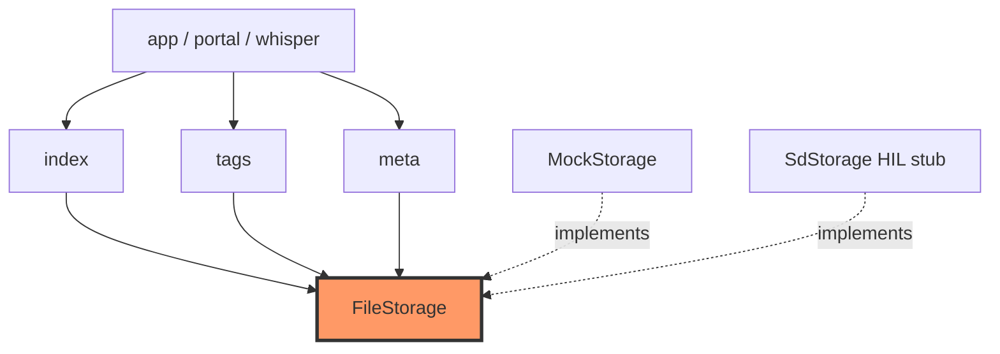

# Core storage

Note index, tags, per-note meta, and `FileStorage` trait + host `MockStorage`. Atomic `.tmp`→rename writes protect `index.csv` and `tags.txt` from power loss mid-save.

## Component in architecture

[architecture.md](../../architecture.md).

## Child docs

| Doc | Source |
|-----|--------|
| [mod.md](mod.md) | `mod.rs` |
| [index.md](index.md) | `index.rs` |
| [tags.md](tags.md) | `tags.rs` |
| [meta.md](meta.md) | `meta.rs` |
| [mock.md](mock.md) | `mock.rs` |

## How components interact

Boot loads `IndexStore` + `TagStore`. Recording calls `add_to_index`; tagging uses `save_tag` / tags CRUD; whisper sets `hasText` via `update_index_has_text`.

## Status

Host-verified; SDIO mount is HIL stub.
