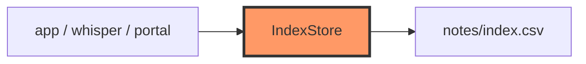

# storage/index.rs

- **Path:** `core/src/storage/index.rs`
- **Purpose:** In-memory note catalog persisted as `notes/index.csv` (`num,tag,hasText`). Supports load/save (atomic), add, update hasText, delete, and next note number allocation.

## Component in architecture



## Responsibilities

- **Does:** CSV parse/serialize, CRUD helpers, `next_note_number`
- **Does not:** store WAV/TXT bodies

## Key types / functions

| Item | Role |
|------|------|
| `NoteEntry` | `num`, `tag`, `has_text` |
| `IndexStore` | `entries`, `find`, `replace_tag`, … |
| `load_index` / `save_index` | Persist via `INDEX_FILE`/`INDEX_TMP` |
| `add_to_index` | Append row |
| `update_index_has_text` | After transcription |
| `delete_note` | Remove row + files (via storage) |
| `next_note_number` | Max+1 |

## Constants / formats

CSV line: `num,tag,0|1`

## Dependencies

Outbound: `paths`, `FileStorage`, `error`. Inbound: app, portal, whisper, tags.

## Tests

```bash
cargo test -p zoop-core storage::index::tests
```

## Status

Host-verified.

## Related

[tags.md](tags.md), [../paths.md](../paths.md), [../../architecture.md](../../architecture.md)
