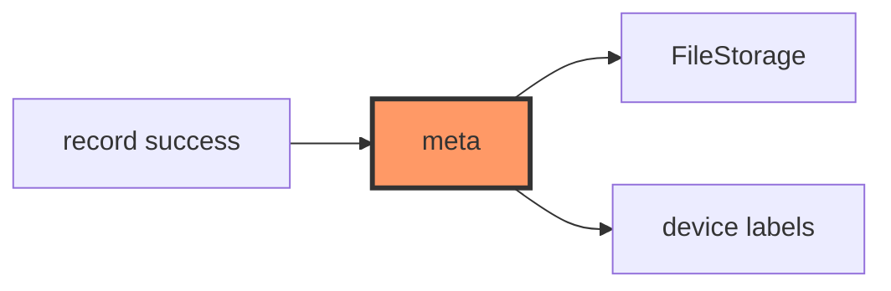

# storage/meta.rs

- **Path:** `core/src/storage/meta.rs`
- **Purpose:** Sidecar metadata for notes (tag stamp helpers, UTC→local device label). Bridges recording success into tag persistence and human-readable time labels on UI/export.

## Component in architecture



## Responsibilities

- **Does:** `note_meta_path`, read/write meta values, `save_tag`, `utc_to_local_device_label`
- **Does not:** own index rows (delegates)

## Key types / functions

| Item | Role |
|------|------|
| `note_meta_path(num)` | Sidecar path |
| `read_note_meta_value` / `write_note_meta` | Key/value meta |
| `save_tag` | Persist chosen tag for note |
| `utc_to_local_device_label` | Apply `LOCAL_TIME_OFFSET_MIN`-style offset |

## Dependencies

Outbound: `paths`, `FileStorage`, `error`. Inbound: app tagging flow.

## Tests

```bash
cargo test -p zoop-core storage::meta::tests
```

## Status

Host-verified.

## Related

[index.md](index.md), [../time.md](../time.md), [../../architecture.md](../../architecture.md)
